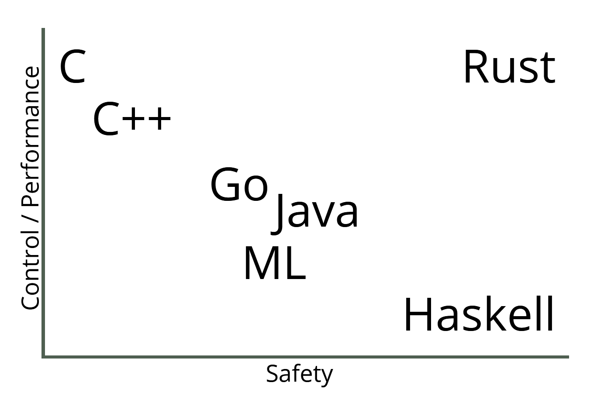
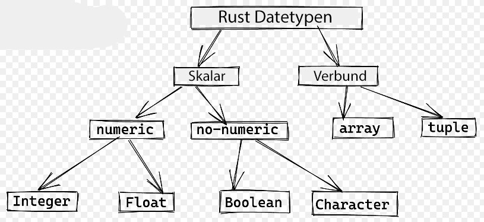
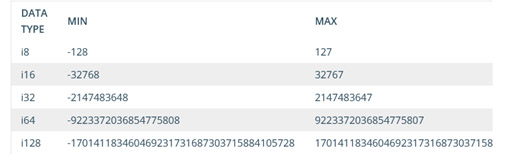
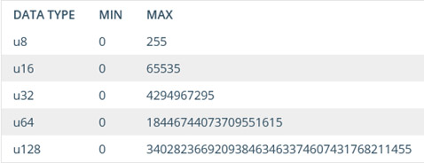
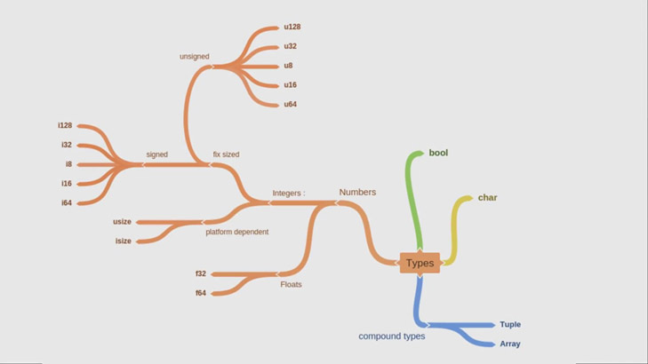
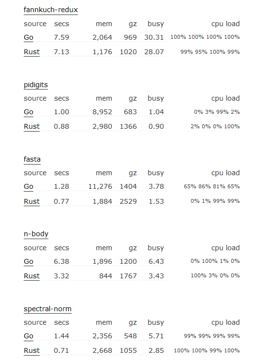

##########
Go vs Rust
##########

Einleitung
==========
Sowohl Rust als auch Golang sind relativ neue Programmiersprachen. 
Während Golang besonders für Serveranwendungen (Web Services und APIs) benutzt wird,
ist Rust im Gebiet Systemprogrammierung und anderer performance- und sicherheitskritischer Anwendungen beliebt. 
Beide eignen sich aber auch sehr gut für parallele Programmierung.

Rust
====
Rust ist eine Programmiersprache, die 2010 von Mozilla Research erstellt wurde und 2015 ist die erste
stabile Version erschienen.

Seit 2016 ist Rust die beliebteste Programmiersprache laut Stackoverflow:

Das Ziel von Rust ist eine hohe Sicherheit. Dies erreicht Rust durch das besondere
Error-Handling und das Ownership Modell. Rust lässt sich kompilieren und hat keinen Garbage Collector,
sondern besitzt das Ownership Modell. Durch dieses Ownership Modell hat Rust zwar eine hohe Lernkurve,
aber auch den Vorteil, dass dadurch viele Probleme garnicht programmierbar sind, da der Compiler 
auf unglaublich viele Sachen achtet. Ein Nachteil davon ist natürlich die Kompilierungszeit.
Diese kann bei Rust auch mal mehrere Minuten oder bei größeren Projekten noch länger dauern.
Rust verliert dadurch aber keine Performance.

Microsoft hat bekannt gegeben, dass 70 % aller CVEs auf Memory Safety Probleme zurückzuführen sind.
Dies ist auch einer der Gründe, warum Microsoft versucht auf Rust umzusteigen und für kritischen Code 
C++ nicht mehr  als akzeptabel empfindet.

Rust gewinnt immer mehr an Beliebtheit und wird bereits auch bei großen Projekten benutzt. Eines der Beispiele
ist Discord, welches den Umstieg von Golang zu Rust geschafft hat, um die Performance zu verbessern.

Hello World
-----------

Wie in jeder Programmiersprache beginnt es immer mit einer einfachen
"Hallo Welt". Um ein "Hello World" -Programm in Rust zu erstellen, muss
man die folgenden Schritte ausführen:

1. Erstellen Sie eine Datei mit dem Name ``main.rs``
    *(Die rust Dateien enden immer mit der Erweiterung ``.rs``)*
2. Öffnen Sie die Datei ``main.rs`` und schreiben Sie den folgenden Code
   hinein

   .. code:: rust

       fn main() {
         println!("Hello world!");
       } 

| Kurze Erklärung:
| ``fn main() {}`` ist eine Funktion. Die Funktionsdeklaration erfolgt
   in Rust mit dem
   `Schlüsselwort <https://de.wikipedia.org/wiki/Schlüsselwort_(Programmierung)>`__
   ``fn``. Das main() stellt außerdem den Einstiegspunkt in die
   Ausführung einer Rust-Anwendung (z.B. in andere Programmiersprache
   wie C# ``public static void Main(string[] args){}``).
| ``println! ("Hallo Welt!");`` druckt einfach die Zeichenfolge in der
   Klammer auf den Bildschirm.

1. Speichern Sie die Datei und öffnen Sie ein Terminalfenster in dem
   Verzeichnis, in dem Sie arbeiten.
2. Wenn Sie Linux oder MacOS verwenden, geben Sie die folgenden Befehle
   ein, um das Programm auszuführen:

    .. code:: shell

        $ rustc main.rs
        $ ./main

1. Wenn Sie Windows verwenden, geben Sie die folgenden Befehle ein, um
   das Programm auszuführen:

    .. code:: shell

        > rustc main.rs
        > .\main.exe

Ausgabe von dem Hello World-Programm:

    .. code:: shell

        Hello world!

Datentypen
----------
Rust Sprache ist eine statisch typisierte Sprache. Das heißt jeder Wert hat einen bestimmten Datentyp. Rust Sprache hat zwei Arten von Datentypen:

* **1-Skalar**
* **2-Verbund**  

**Skalar-Datentyp:** Mit dem skalaren Typ stellt man einen einzelnen Wert dar. Es gibt zwei Arten von Skalar-Typen: (numerisch & nicht-numerisch). Bei dem numerischen Typen geht’s um Ganzzahlen und Fließkommazahlen. Bei dem nicht numerischen Typen geht’s um boolesche Werte (Wahrheitswerte) und Zeichen.

**Integer:**

.. code-block:: rust

  let x = 5;
  let life = 42;
  let jenny = 8675309;

**Boolean:**

.. code-block:: rust

  let t = true;
  let f = false;

**Character:**

.. code-block:: rust

  let a = 'a';
  let b = 'b';

**Float:**

.. code-block:: rust

  let pi = 3.14;
  let e = 2.718;

**Verbund-Datentyp:** Bei dem Verbund-Typen (compound types) geht’s darum mehrere Werte zu einem Typ zu gruppieren. Rust hat zwei primitive Verbund-Typen: Tupel (tuples) und Arrays (arrays).

**Tuple:**

.. code-block:: rust

 let tuple = ("hello", 42, "world", [3,6,9]);

 println!("First element is {}", tuple.0);
 println!("Second element is {}", tuple.1);
 println!("Third element is {}", tuple.2);
 let mut counter = 0;
 for x in &tuple.3 {
    println!("Element {} of the fourth element is {}", counter, x);
    counter += 1;
    }

**Array:**

.. code-block:: rust

 let name: [type; size] = [elem1, elem2, elem3, elem4];

 let array: [i32; 5] = [0, 1, 2, 3, 4];

 println!("The first element of the array is: {}", array[0]);

 let mut counter = 0;
 for x in array.iter(){
    println!("The element at index {} is {}", counter, x);
    counter += 1;
    }

**Datentypgrößen:**

- **Integer:**

Integer hat zwei Arten von Größen: Vorzeichenbehaftet und ohne Vorzeichen:

**Mit Vorzeichen:**

.. code-block:: rust

  let x = 10; // default integer Typ ist in Rust i32 Bits (vier Bytes)
  let y: i8 = -128;

**Ohne Vorzeichen:**

.. code-block:: rust

  let z: u8 = 254;

**Float (Fließkommazahlen):**
**1-f32 (4 Bytes)**
**2-f64(8 Bytes)**

.. code-block:: rust

  let x = 1.5; // default float Typ ist in Rust f64(8Bytes)
  let y: f64 = 2.0;

**Platform abhängige Größen:**
Es sind zwei Arten von plattformabhängigen Datentypgrößen: 
1- isize (4 Bytes for 32bit Betriebsystem und 8 Bytes für 64bit Betriebsystem)
2- usize (4 Bytes for 32bit Betriebsystem und 8 Bytes für 64bit Betriebsystem)

**Char:**
Char ist in Rust vier Bytes Groß, da Rust Unicode-Benutzung ermöglicht. 

.. code-block:: rust

  let y: char = '😎';
  let Z: char = '🌞';

Syntax
------
Rust Syntax ist ähnlich wie C und C++ Sprache. Wie von vielen Sprachen man kennt, arbeitet man auch bei Rust mit Funktionen, Schleifen, Abfragen, Konstanten und Variablen.
- **Funktion:** Eine neue Funktion wird bei Rust durch den Befehl „fn“ definiert.

.. code-block:: rust

    fn increment(i:int) -> (int) {
        i + 1
    }

- **Makros:** 

Rust arbeitet mit Makros, die sich durch ein Ausrufezeichen am Ende des Begriffs auszeichnen..

.. code-block:: rust

 fn main() {
     assert!(4==5);//Das Makro assert! hier beendet das Programm, wenn die ihm übergebene Bedingung nicht wahr ist:
  println("This is never printed.");
  }

- **Variablen:** Variablen lassen sich mit **„let“** bestimmen; damit die Angaben verändert werden können, muss dies explizit mit **„mut“** erlaubt werden.

.. code-block:: rust

   let count = 0;//immutable
   let mut count = 0; ;//mutable

- **Loops:** Loops werden in Rust mit **For**-und **while**-Schleifen erreicht. Die Körper von Schleifenstrukturen müssen in geschweifte Klammern eingeschlossen werden, und die Kontrollbedingung der while- und for-Schleifen müssen nicht in Klammern eingeschlossen werden.
   **Break** verlässt Schleifen, und continue beendet die aktuelle Iteration und fährt mit der Nächsten fort.

   **For loop:** For-Schleifen iterieren über einen Bereich von Zahlen

.. code-block:: rust

  for n in range(0, 5) {
    println!("{}", n);
    }

**While loop:** While-Schleifen, bis eine Bedingung erfüllt ist.

.. code-block:: rust

  let mut count = 0;
  while count < 10 {
    println!("count is {}", count);
    count += 1;
    }

Error Handling
--------------

In Rust unterscheidet man zwischen einem behebbaren Error und einem nicht behebbaren Error. 
In den meisten Programmiersprachen gibt es diesen Unterschied nicht und es werden stattdessen 
Exceptions verwendet.

Unbehebbarer Fehler
^^^^^^^^^^^^^^^^^^^

Für ein unbehebbaren Fehler verwendet man folgendes Makro: :code:`panic!`
Die Idee hinter diesem Typ von Error ist, dass es sich meistens um Bugs handelt, die nicht vom
User behandelt werden sollen, sondern nur um eine Info, dass etwas falsch benutzt wird.
Ein gutes Beispiel wäre der Zugriff auf ein Index im Array, welcher höher ist als die Arraylänge.
In der Programmiersprache C würde es zu einem nicht definierten Verhalten führen und man würde unter
Umständen ein Element bekommen, welches momentan an dieser Adresse liegt.
Dies deutet im Normalfall auf einen Programmierfehler hin und wird so in Rust abgefangen, 
dadurch erreicht Rust eine erhöhte Sicherheit im Vergleich zu C.

Folgendes Beispiel würde ein panic aufrufen:

.. code-block:: rust

    fn main() {
        let v = vec![1, 2, 3];
        v[99];
    }

Man bekommt folgenden Fehler:

:code:`thread 'main' panicked at 'index out of bounds: the len is 3 but the index is 99'`

Behebbare Fehler
^^^^^^^^^^^^^^^^

Natürlich gibt es aber auch Fehler, die entstehen können, aber nicht direkt vom Programmcode verursacht werden.
Ein Beispiel hierfür wäre eine Datei, welche man öffnen möchte, 
da die Datei möglicherweise nicht existiert oder die Rechte dafür nicht ausreichen.

Dafür bietet Rust einen Typ an:

.. code-block:: rust

    enum Result<T, E> {
        Ok(T),
        Err(E),
    }

Falls es einen Error gibt, wird der Error vom Typ :code:`E` sein, ansonsten wird beim Erfolg der Typ :code:`T` zurückgegeben.

Das öffnen einer Datei würde so ablaufen:

.. code-block:: rust

    use std::fs::File;
    
    fn main() {
        let f = File::open("hello.txt");
    
        let f = match f {
            Ok(file) => file,
            Err(error) => panic!("Problem opening the file: {:?}", error),
        };
    }

Wenn es keinen Error gab wird :code:`Ok(file) => file` ausgeführt, ansonsten werfen wir ein panic (unbehebbaren Fehler).

Kürzer kann man das auch so schreiben: 

.. code-block:: rust

    use std::fs::File;
    
    fn main() {
        let f = File::open("hello.txt").unwrap();
    }

:code:`unwrap` ruft ein Panic, falls es einen Error gibt.

Oder mit einer eigenen Panic Message:

.. code-block:: rust

    use std::fs::File;
    
    fn main() {
        let f = File::open("hello.txt").expect("Failed to open hello.txt");
    }

:code:`unwrap` oder :code:`expect` verwendet man häufig, wenn man sich sicher sein kann, dass es keinen Error gibt. 
Ein Beispiel wäre das Parsen der IP Adresse, welches der Compiler nicht garantieren kann, 
wir uns aber sicher sind, dass das Format das richtige ist.

.. code-block:: rust

    fn main() {
        use std::net::IpAddr;
        let home: IpAddr = "127.0.0.1".parse().unwrap();
    }

? keyword
^^^^^^^^^

Möchte man einen Error weiter leiten und nicht handeln, kann man dies ganz einfach tun,
indem man anstelle eines unwraps ein :code:`?` setzt.

Mit folgendem Beispiel versuchen wir ein Usernamen von einer Datei zu lesen. Bei jedem Result Typ 
hängen wir aber ein :code:`?` an, um in der Funktion ein Error zu returnen, falls es ein Error gibt.

.. code-block:: rust

    fn read_username_from_file() -> Result<String, io::Error> {
        let mut f = File::open("hello.txt")?;
        let mut s = String::new();
        f.read_to_string(&mut s)?;
        Ok(s)
    }

Objektorientierung
------------------

Rust erlaubt für einen struct Typ Methoden zu erstellen:

.. code-block:: rust

    struct List {
        list: Vec<i32>
    }
    
    impl List {
        fn add(&mut self, value: i32) {
            self.list.push(value);
        }
    }

In Rust gibt es nun keine Vererbung, es gibt aber Traits. Traits sind die Antwort von Rust auf Interfaces. Traits können von verschiedenen structs implementiert werden.

In folgendem Beispiel erstellen wir ein :code:`Text` und :code:`Number` Struct, welche beide den 
:code:`Printable` Trait implementieren.
Dann haben wir noch ein Struct :code:`Console`, welches eine Liste von Printables besitzt und
diese in der run Methode ausprinten kann.

.. code-block:: rust

    trait Printable {
        fn print(&self);
    }
    
    struct Console {
        components: Vec<Box<dyn Printable>>,
    }
    
    impl Console {
        fn run(&self) {
            for component in self.components.iter() {
                component.print();
            }
        }
    }
    
    struct Text {
        text: String,
    }
    
    impl Printable for Text {
        fn print(&self) {
            println!("Text: {}", self.text)
        }
    }
    
    struct Number {
        number: i32,
    }
    
    impl Printable for Number {
        fn print(&self) {
            println!("Number: {}", self.number)
        }
    }
    
    fn main() {
        let mut console = Console { components: vec![] };
        console.components.push(Box::new(Number { number: 2 }));
        console.components.push(Box::new(Number { number: 3 }));
        console.components.push(Box::new(Text {
            text: "I am of type Text".to_string(),
        }));
    
        console.run()
    }

Cargo (Paketmanager)
--------------------

Cargo ist der Paketmanager für Rust. Dies ermöglich die Verwaltung von
Rust-Projekte.

Cargo hilft beim Herunterladen von Bibliotheken von Drittanbietern. Man
kann auch eigene Bibliotheken erstellen. Außerdem Cargo ist
standardmäßig schon vorinstalliert, wenn man Rust installiert hat.

Um ein neues Cargo Projekt zu erstellen, kann man die folgenden Befehle
verwenden:

1. Erstellung ein neues Projekt
^^^^^^^^^^^^^^^^^^^^^^^^^^^^^^^

.. code-block:: bash

    cargo new project_name --bin

Nach der Ausführung der Anweisung wird ein Verzeichnis mit 2 Dateien
generiert, wie unten:

.. code-block:: bash

    ubuntu@test:~/project_name$ tree .
    .
    ├── Cargo.toml
    └── src
        └── main.rs

    1 directory, 2 files

1. Das **Cargo.toml** (auch genannt Manifest) enthält alle Metadaten,
die Rust zum Kompilieren des Pakets benötigt. Diese Datei ist im
TOML-Format geschrieben.

.. code-block:: toml

    [package]
    name = "project_name"
    version = "0.1.0"
    authors = ["ubuntu"]
    edition = "2018"

    # See more keys and their definitions at https://doc.rust-lang.org/cargo/reference/manifest.html

    [dependencies]

2. Und das **main.rs** (auch gennant *binarycrate*), in dem es normalweise den folgenden Code gibt :

.. code-block:: rust

    fn main() {
        println!("Hello, world!");
    }

2. Hinzufügen einer externen Bibliothek
^^^^^^^^^^^^^^^^^^^^^^^^^^^^^^^^^^^^^^^

Von dem folgenden Portal `Creates.io <https://crates.io/>`_ kann man
externe Library finden und in dem eigenen Projekt auch integrieren. Um
das zu machen, fügt man in die Datei **Cargo.toml** die Name und die
Version der entsprechenden Bibliothek (z.B. ``libc = "0.2"``) nach dem
Abschnitt ``[dependencies]``

.. code-block:: toml

    [package]
    name = "project_name"
    version = "0.1.0"
    authors = ["ubuntu"]
    edition = "2018"

    # See more keys and their definitions at https://doc.rust-lang.org/cargo/reference/manifest.html

    [dependencies]
    libc = "0.2"

3. Rust-Projekt kompilieren
^^^^^^^^^^^^^^^^^^^^^^^^^^^

Mit der folgenden Anweisung, kompiliert man das Projekt

.. code-block:: shell

    cargo build

Ausgabe, nach der *erfolgreichen Kompilierung*:

.. code:: shell

    Updating crates.io index      
    Downloaded libc v0.2.92      
    Downloaded 1 crate (522.5 KB) in 1.04s      
    Compiling libc v0.2.92      
    Compiling project_name v0.1.0 (/home/ubuntu/project_name)      
    Finished dev [unoptimized + debuginfo] target(s) in 53.21s

4. Binärdatei ausführen
^^^^^^^^^^^^^^^^^^^^^^^

.. code-block:: shell

    cargo run 
    # oder 
    ./target/debug/project_name

Ownership
---------
Rust Ownership ist das wohl besonderste Feature in Rust. Es erlaubt die Memory Safety ohne die 
Verwendung eines Garbage collectors (vgl. Java, Python, C#) oder der manuellen Speicherverwaltung (vgl. C, C++).

Allgemeine Regeln:
^^^^^^^^^^^^^^^^^^

* Jeder Wert in Rust hat eine Variable, welcher als Besitzer zählt.
* Es kann nur einen Besitzer zur gleichen Zeit geben.
* Wenn der Besitzer aus dem Scope geht, wird der Wert freigegeben.

Ein Wert = Ein Besitzer:
^^^^^^^^^^^^^^^^^^^^^^^^

.. code-block:: rust

    fn main() {
        let mut s = String::from("hello");
        let r1 = &mut s;
        s = String::from("world");
        println!("{}", r1);
    }

Wir haben die Variable s erstellt und leihen diese bei der Erstellung von :code:`r1` aus, d. h. der Besitzer geht von
:code:`s` auf :code:`r1` rüber. Somit kompiliert dieser Code nicht, denn :code:`s` ist nicht mehr der Besitzer und kann :code:`s` nicht mehr ändern.
Etwas genauer, :code:`r1` wird später nochmal im println verwendet und erhält deswegen über den gesamten Zeitraum die Ownership.
Würde man das println mit der neuen Zuweisung von :code:`s` tauschen, würde dieser Code kompileren. Grund dafür ist, dass
:code:`r1` solange Besitzer bleibt, bis die Variable nicht mehr benutzt wird, dann wird :code:`s` automatisch wieder Besitzer.

Nur ein Besitzer zur gleichen Zeit:
^^^^^^^^^^^^^^^^^^^^^^^^^^^^^^^^^^^

.. code-block:: rust

    fn main() {
        let mut s = String::from("hello");
    
        let r1 = &mut s;
        let r2 = &mut s;
    
        println!("{}, {}", r1, r2);
    }

Dieser Code wird nicht kompiliert, denn man erhält folgenden Fehler:
:code:`error[E0499]: cannot borrow s as mutable more than once at a time`
Der Grund dafür ist, wie der Kompilierfehler schon sagt, dass die Variable :code:`s` 2 Besitzer hat, was nicht möglich ist.

Immutable vs Mutable borrow
^^^^^^^^^^^^^^^^^^^^^^^^^^^

Wenn man eine Variable als immutable ausleiht, ist es nicht mehr erlaubt diese auch als mutable auszuleihen, solange
der Besitzer beim Immutable ist. Dadurch lässt sich folgender Code nicht kompilieren.

.. code-block:: rust

    fn main() {
        let mut s = String::from("hello");
        let r1 = &s;
        let r2 = &mut s;
        println!("{}", r1);
    }

Unsafe
------
Das unsafe Keyword bietet viele Möglichkeiten, die Rust normalerweise verbietet. So besteht auch
die Möglichkeit Raw Pointer zu verwenden wie in C/C++. Auf der einen Seite sollte man so wenig
unsafe Code wie möglich schreiben (in vielen Fällen braucht man garkeinen), in Spezialfällen ist dies aber nötig
und hat einen großen Vorteil: Im Vergleich zu C/C++ ist der unsafe Code in Rust gekennzeichnet und man kann so
den Fokus darauf legen, diesen Codeabschnitt besser zu testen oder zu überprüfen.
Bei C/C++ gäbe es nur unsafe Code und somit ist ein FFI Call zu C in Rust immer unsafe.

Mit Unsafe wäre also folgender Code möglich:

.. code-block:: rust

    fn main() {
        let raw_p: *const u32 = &10;
        unsafe {
            assert!(*raw_p == 10);
        }
    }

Ohne Unsafe wäre dies nicht möglich, da man einen raw Pointer nicht dereferenzieren kann. Grund dafür ist,
dass ein Raw Pointer ggf. NULL ist, Data Races verursachen kann und vieles mehr, was Rust versucht zu unterbinden.

Golang
======

Die Programmiersprache Golang wurde im März 2012 zur Produktpalette des riesigen Internetdienstleisters Google hinzugefügt. Die Sprache entstand, als Google-Mitarbeiter an die Grenzen der zur Verfügung stehenden Programmiersprachen Java und C++ stießen.
Go ist bereits so ausgereift und stabil, dass sie von Entwicklern weltweit eingesetzt wird, obwohl sie im Vergleich zu anderen Programmiersprachen noch relativ jung ist. Die Sprache kann durch Simplizität und Multifunktionalität überzeugen. Im Gegensatz zu etablierten Vertretern zeichnet sich die Sprache durch effiziente Code-Kompilierung, schnelle Code-Ausführung und einen einfachen Programmierungsprozess in einer Maschinensprache aus. Durch Kombination wichtiger Features aus unterschiedlichen Sprachfamilien konnte Go diese wichtigen Eigenschaften vereinen. Go-Anwendungen überzeugen im Allgemeinen im Vergleich zu anderen Compiler-Sprachen mit einer hohen Ausführungsgeschwindigkeit. Im Vergleich mit Java entspricht die Kompilierungsgeschwindigkeit etwa die von Go. Das liegt zum einen daran, dass Go z.B. importierte Elemente nicht kompiliert, wenn diese nicht auch tatsächlich genutzt werden. Des Weiteren, um beispielsweise HTTP-Anfragen zu beantworten, verwendet Go im Gegensatz zu Java eine vorhandene Implementierung der Standardbibliothek, was den Startvorgang erheblich beschleunigt.

Hello World
-----------
Die Syntax der Programmiersprache C wurde als Vorbild für die Sprache Go verwendet. Auf das Semikolon kann hingegen verzichtet werden.

1. Erstellen Sie eine Datei mit dem Namen ``main.go``.
    *(Die go Dateien enden immer mit der Erweiterung ``.go``)*
2. Öffnen Sie die Datei ``main.go`` und schreiben Sie den folgenden Code
   hinein:

.. code-block:: go

    func main() {
        fmt.Println("hello world!")
    }

| Kurze Erklärung:
| ``func main() {}`` ist eine Funktion. Die Funktionsdeklaration erfolgt in Go mit dem Schlüsselwort ``func``.
| ``fmt.Println("hello world!")`` druckt die Zeichenfolge in der
   Klammer auf den Bildschirm.

1. Speichern Sie die Datei und öffnen Sie ein Terminalfenster in dem
   Verzeichnis, in dem Sie arbeiten.
2. Geben Sie den folgenden Befehl
   ein, um das Programm auszuführen:

    .. code:: shell

        $ go run main.go

Ausgabe von dem Hello World-Programm:

    .. code:: shell

        hello world!

Datentypen
----------

Basis Datentyp
^^^^^^^^^^^^^^

Während in Java Datentypen bei einer Deklaration vor den Bezeichner geschrieben wird, muss man bei Go den Datentyp dahinter schreiben, um die Deklaration von Funktionstypen zu vereinfachen.

.. code-block:: go

    func main() {
    var name string = "Go"
    fmt.Println(name)
    }

**Integer:**

.. code-block:: go
    
    var x int = 5;

    
Die Typen int, uint und uintptr sind auf 32-Bit-Systemen normalerweise 32 Bit und auf 64-Bit-Systemen 64 Bit breit.

    
**Boolean:**
    
.. code-block:: go
    
    var t bool= true;
    var f bool = false;
    
    
**Float:**
    
.. code-block:: go
    
    var pi float64 = 3.14;

    
    

Array
^^^^^^

Zuweisung eines Arrays zu einem anderen kopiert alle Elemente dessen.
Wenn ein Array an eine Funktion übergeben wird, erhält die Funktion eine Kopie des Array und nicht einen Zeiger darauf.

.. code-block:: go

    func main() {
        var a [2]string
        a[0] = "Hello"
        a[1] = "World"
        fmt.Println(a[0],a[1])
    }

List
^^^^

.. code-block:: go

    import (
        "fmt"
        "container/list"
       )
    
    func main() {
        list := list.New()  //initialize an empty list
        list.PushFront(10)  //pushes item to the front of the list
        list.PushBack(20)   //pushes item to the end of the list
        fmt.Println(list.Front()) // &{0xc000072420 0xc0000723c0 0xc0000723c0 10}
        fmt.Println(list.Back())  // &{0xc0000723c0 0xc0000723f0 0xc0000723c0 20}
    
        //Remove items from the list
        r := list.PushBack(30)  //store the reference
        list.Remove(r)          //remove using the reference
    
        for e := list.Front(); e != nil;  e = e.Next() { // &{0xc000072420 0xc0000723c0 0xc0000723c0 10}
            fmt.Println(e)                               // &{0xc0000723c0 0xc0000723f0 0xc0000723c0 20}
        }
    }

Syntax
^^^^^^

Go orientiert sich syntaktisch an der Programmiersprache C mit einigen Einflüssen aus den Sprachen Pascal, Modula und insbesondere Oberon.

-  Loops

Go hat nur ein Schleifenkonstrukt, die for-Schleife.
Die grundlegende for-Schleife besteht aus drei Komponenten, die durch Semikolons getrennt sind:
Die Schleife stoppt die Iteration, sobald die boolesche Bedingung false ergibt.

.. code-block:: go
    
    package main

    import "fmt"

    func main() {
        sum := 0
        for i := 0; i < 10; i++ {
            sum += i
        }
        fmt.Println(sum)
    }

Es ist dennoch möglich in Go "while" mit einer for-Schleife zu konstruieren.

.. code-block:: go
    
    package main

    import "fmt"

    func main() {
        sum := 1
        for sum < 1000 {
            sum += sum
        }
        fmt.Println(sum)
    }

Wenn Sie die Schleifenbedingung weglassen, wird sie für immer wiederholt, sodass eine Endlosschleife kompakt ausgedrückt wird.

.. code-block:: go
    
    package main

    func main() {
        for {
        }
    }

-  If
  
Go's if-Anweisungen sind wie for-Schleifen. Der Ausdruck muss nicht in Klammern () stehen, aber die geschweiften Klammern {} sind erforderlich. 

.. code-block:: go
    
    package main

    import (
        "fmt"
        "math"
    )

    func sqrt(x float64) string {
        if x < 0 {
            return sqrt(-x) + "i"
        }
        return fmt.Sprint(math.Sqrt(x))
    }

    func main() {
        fmt.Println(sqrt(2), sqrt(-4))
    }

-  If else
  
.. code-block:: go
    
    if v := math.Pow(x, n); v < lim {
    return v
    } else {
    fmt.Printf("%g >= %g\n", v, lim)
    }
    

-  Switch
  
Eine switch-Anweisung ist eine kürzere Möglichkeit, eine Folge von if-else-Anweisungen zu schreiben. Es wird der erste Fall ausgeführt, dessen Wert dem Bedingungsausdruck entspricht.
Der Schalter von Go ähnelt dem in C, C ++, Java, JavaScript und PHP, außer dass Go nur den ausgewählten Fall ausführt, nicht alle folgenden Fälle. 

.. code-block:: go
    
    package main

    import (
        "fmt"
        "runtime"
    )

    func main() {
        fmt.Print("Go runs on ")
        switch os := runtime.GOOS; os {
        case "darwin":
            fmt.Println("OS X.")
        case "linux":
            fmt.Println("Linux.")
        default:
            // freebsd, openbsd,
            // plan9, windows...
            fmt.Printf("%s.\n", os)
        }
    }

Objektorientierung
^^^^^^^^^^^^^^^^^^
    
Objektorientierte Programmierung ist ein Paradigma, das mit Klassen und Objekten arbeitet. Go unterstützt keine Klassen und Objekte. Dennoch ist in der Sprache etwas Objektorientierung möglich. In gewisser Weise ermöglicht Go eine abgewandelte OOP.
    
Go unterstützt benutzerdefinierte Typen über Strukturen. Dies ermöglicht das Definieren einer benutzerdefinierten Datenstruktur sowie eines klassenähnlichen Verhaltens in Go. Typen können Methoden zugeordnet sein. Hier ist ein Beispiel für einen benutzerdefinierten Typ. 

.. code-block:: go

    package main
    
    import "fmt"
    
    type Student struct {
        Name string
        Roll int
    }
    
    func (s Student) Print() {
        fmt.Println(s)
    }
    
    func main() {
    
        jack := Student{"Jack", 123}
    
        jack.Print() // {Jack 123}
    }

Im obigen Code ist Student struct ein benutzerdefinierter Typ. Er hat auch eine Methode print, die man direkt von einem Objekt seines Typs aufrufen kann. Dieses Typsystem in Go emuliert klassenähnliches Verhalten. 

Error und exception handling
----------------------------
| Go unterstützt Fehler auf eine sehr einfache Weise. Go-Funktionen geben Fehler als zweiten Rückgabewert zurück. Das ist die Standardmethode zur Implementierung und Verwendung von Fehlern in Go. Das bedeutet, dass der Fehler sofort überprüft werden kann, bevor mit den nächsten Schritten fortgefahren wird.
| Es gibt mehrere Methoden, um Fehler zu erzeugen.

Verwendung der Funktion New: Das GoLang-Fehler-Paket verfügt über eine Funktion namens New(), mit der sich Fehler einfach erstellen lassen:

.. code-block:: go

    package main

    import (
        "fmt"
        "errors"
    )

    func e(v int) (int, error) {
        if v == 0 {
            return 0, errors.New("Zero cannot be used")
        } else {
            return 2*v, nil
        }
    }

    func main() {
        v, err := e(0)

        if err != nil {
            fmt.Println(err, v)      // Zero cannot be used 0
        }
    }

Verwendung der Funktion Errorf: Das fmt-Paket verfügt über eine Errorf()-Methode, die solche formatierten Fehler ermöglicht:

.. code-block:: go

    fmt.Errorf("Error: Zero not allowed! %v", v)  // Error: Zero not allowed! 0

| Panic und recover:
| Panic tritt auf, wenn etwas unerwartetes Falsches passiert. Sie stoppt die Funktionsausführung. Recover ist das Gegenteil davon. Es erlaubt uns, die Ausführung vom Anhalten wiederherzustellen.

.. code-block:: go

    package main

    import (
        "fmt"
    )

    func f(s string) {
        panic(s)      // throws panic
    }

    func main() {
            // defer makes the function run at the end
        defer func() {      // recovers panic
            if e := recover(); e != nil {
                        fmt.Println("Recovered from panic")
                }
        }()

        f("Panic occurs!!!") // throws panic

        // output:
        // Recovered from panic
    }

| Erstellen von benutzerdefinierten Fehlern:

.. code-block:: go

    type CustomError struct {
        data string
    }

    func (e *CustomError) Error() string {
        return fmt.Sprintf("Error occured due to... %s", e.data)
    }

| Rückgabe von Fehlern neben Werten:
| Go unterstützt mehrere Rückgabewerte. Wir können also einen beliebigen Wert und einen Fehler gleichzeitig zurückgeben und dann den Fehler überprüfen.

.. code-block:: go

    import (
        "fmt"
        "errors"
    )

    func returnError() (int, error) {  // declare return type here
        return 42, errors.New("Error occured!")  // return it here
    }

    func main() {
        v, e := returnError()
        if e != nil {
            fmt.Println(e, v)  // Error occured! 42
        }
    }

| Ignorieren von Fehlern in Go:
| Go hat den Operator skip (_), der es erlaubt, zurückgegebene Fehler zu überspringen.

.. code-block:: go

    package main

    import (
        "fmt"
        "errors"
    )

    func returnError() (int, error) {  // declare return type here
        return 42, errors.New("Error occured!")  // return it here
    }

    func main() {
        v, _ := returnError()   // skip error with skip operator

        fmt.Println(v)    // 42
    }

Paketmanagement
---------------
| In Version 1.11 führte Go seinen offiziellen Paketmanager Go Module ein. Eine Sammlung von Paketen mit potenziellen Abhängigkeiten wird als Modul bezeichnet. Pakete werden in drei Kategorien unterteilt:
| - Standardpakete wie fmt, net/http usw. sind allesamt Standardpakete, die von golang selbst gepflegt werden.
| - Anwendungspakete werden von den Entwicklern selbst verwaltet.
| - Externe Pakete müssen aus dem Internet heruntergeladen werden.

Go Module:

Über den Befehl ``$ go mod init`` werden im Projektverzeichnis die beiden Dateien go.mod und go.sum erstellt. Go behandelt jedes Projekt als ein Modul. Der Modulschlüssel ist das erste Wort in der Datei go.mod, das dem Compiler Ihren Modulnamen mitteilt.

| Es gibt insgesamt 4 Richtlinien, die in der Datei go.mod verwendet werden können:
| •	Module: Verwendete packages
| •	Require: Benötigte packages
| •	Replace: Bestimmtes package durch anderes z.B. mit anderer Version ersetzen
| •	Exclude: Bestimmtes package vom Download ausschließen

So könnte eine solche Datei vereinfacht aussehen:

.. code-block:: go

    module sampleproject

    go 1.14

    Require (
     github.com/sirupsen/logrus v1.4.2
    )

Besonderheiten
--------------
• GOPATH-Umgebung als Basis: Eine der ersten Amtshandlungen bei der Programmierung mit Go besteht darin, das GOPATH-Verzeichnis inklusive der drei Unterverzeichnisse „src“ (Go-Quelldateien), „pkg“ (Go-Paket-Objekte „package objects“) und „bin“(ausführbare Kommandos) anzulegen. Jeglicher Go-Code, der geschrieben wird, lässt sich inklusive der entsprechenden Abhängigkeiten über diesen Workspace verwalten. Der Speicherort dieses verpflichtenden GOPATH-Verzeichnisses lässt sich dabei frei wählen.
• Modularer Aufbau mit GOLANG-Paketen (Packages): Quelldateien lassen sich in Golang modular über Verzeichnisse organisieren, die als Packages bzw. Pakete bezeichnet werden. Der Name des jeweiligen Verzeichnisses ist damit gleichzeitig auch der Name des Pakets, zu dem alle Quelldateien gehören, die sich in diesem Verzeichnis befinden.
• Einheitliche, vorgeschriebene Code-Formatierung: Golang gibt bestimmte Konventionen für die Formatierung des Codes vor, beispielsweise für den exakten Abstand zwischen den einzelnen Elementen. Das integrierte Tool gofmt optimiert geschriebenen Golang-Code automatisch, indem es fehlerhafte Formatierungen behebt.
• Relative Importe als Standard: Alle Dateien und Pakete, die man in Golang-Projekte importiert, sind immer relativ zum Verzeichnis GOPATH/src, was den Importvorgang sehr unkompliziert macht. Ferner kompiliert Go importierte Elemente nicht, wenn diese nicht auch tatsächlich genutzt werden. Auf diese Weise ist ein sauberer Code auch dann garantiert, wenn importierte Komponenten nicht bzw. nicht mehr zum Einsatz kommen.
• Multiple Rückgabewerte für Funktionen und Methoden: Mit Go lassen sich Funktionen und Methoden erzeugen, die mehrere Werte zurückgeben können. Damit kann Go beispielsweise ein gültiges Ergebnis und einen alternativ angegebenen Fehler bei der Rückgabe sauber voneinander trennen (siehe Beispiel oben).

Vorteile und Einsatzgebiete
---------------------------
• Ein ausdrucksstarkes, aber leichtgewichtiges Typsystem zur optimalen Einordnung und Differenzierung der verschiedenen Objekte wie Variablen, Funktionen etc.
• Nebenläufigkeit (parallele Programmierung) für eine schnellere Programmausführung
• Die bereits erwähnte automatische Speicherbereinigung (GC) für eine optimale Nutzung des verfügbaren Speichers und zur Vermeidung von Speicherproblemen
• Eine strikte Spezifikation von Abhängigkeiten ohne aufwendige Deklarationssyntax
• Plattformunabhängigkeit, die eine Nutzung entwickelter Anwendungen auf allen gängigen Systemen ermöglicht

Aufgrund dieser Vorteile wird Golang bis dato vor allem im Unternehmens- und Serverumfeld eingesetzt, wo die Stabilität und Performance von Diensten eine wichtige Rolle spielen.
Auch bei bei der containerbasierten Virtualisierung spielt die Sprache eine sehr wichtige Rolle, was zum Teil auch an Docker liegt.
Diese Container-Plattform basiert nämlich auch auf Go.

Go vs Rust
==========

Rust und Go haben viel gemeinsam, was ein Grund ist, warum man diese gerne miteinander  vergleicht. Beide Sprachen sind modern, leistungsstark, weit verbreitet und bieten hervorragende Leistung. Jedoch repräsentiert jede Programmiersprache eine Reihe von Kompromissen und ist für unterschiedliche Fälle optimiert.

**Memory safety**

Über viele Jahrzehnte hinweg wurde bei der Verwendung älterer Sprachen wie C und C ++ deutlich, dass eine der Hauptursachen für Fehler und Sicherheitslücken darin besteht, unsicher oder falsch auf den Speicher zuzugreifen. Moderne Programmiersprachen wie Go oder Rust haben diesem Thema eine hohe Priorität zugesprochen und haben es geschafft intelligenter und sicherer als andere Sprachen zu sein.

**Ausführbare Dateien**

Im Gegensatz zu interpretierten Sprachen wie Python oder Ruby ist es bei Go und Rust möglich die Programme direkt über eine kompilierte Datei auszuführen. Die Programme werden direkt in ausführbaren Maschinencode übersetzt, was dazu führt, dass Go und Rust Programme im Vergleich zu interpretierten Sprachen extrem schnell sind.

**Parallelität**

Go wurde von Grund auf für diesen Job entwickelt. Anstatt Betriebssystem-Threads zu verwenden, bietet Go eine einfache Alternative: Goroutinen. Jede Goroutine ist eine unabhängig ausgeführte Go-Funktion, die der Go-Scheduler einem der von ihm kontrollierten Betriebssystem-Threads zuordnet. Dies bedeutet, dass der Scheduler eine große Anzahl gleichzeitiger Goroutinen sehr effizient verwalten kann, wobei nur eine begrenzte Anzahl von Betriebssystem-Threads verwendet wird. Parallelisierung in Rust ist hingegen sehr neu und befindet sich noch in einer sehr aktiven Entwicklung. Die Rayon-Bibliothek ermöglicht es z.B. sehr elegant und einfach, sequentielle Berechnungen in parallele umzuwandeln. Im Großen und Ganzen kann man jedoch sagen, dass die Implementierung paralleler Programme in Rust etwas unkomplizierter ist.

**Performance**

Sowohl Go als auch Rust sind dafür geeignet sehr schnelle Programme zu produzieren, da sie zu nativen Maschinencode kompiliert wurden. Ein Interpreter ist nicht vonnöten. Die Sprache Go ist in erster Linie auf Entwicklungsgeschwindigkeit und nicht auf Ausführungsgeschwindigkeit ausgelegt. Der Compiler ist nicht dazu ausgelegt den effizientesten Maschinencode zu generieren. Es geht eher darum viel Code, schnell zu kompilieren. Daher schlägt Rust Go normalerweise in Laufzeit-Benchmarks. Die Leistung von Rust ist vergleichbar mit C und C ++, die oft als die leistungsstärksten kompilierten Sprachen angesehen werden. Die Sprache bietet zusätzlich als Bonus Speichersicherheit und Parallelitätssicherheit. Da Rust eine vollständige Kontrolle über die zugrunde liegende Hardware ermöglicht, ist diese Sprache eine gute Wahl für Bereiche, in denen die Ausführungsgeschwindigkeit an erster Stelle steht. z.B. Spieleprogrammierung oder für Webbrowser-Komponenten.
Das folgende Bild illustriert die Überlegenheit von Rust im Bereich Performance.

Mehr Vergleiche finden Sie  `hier. <https://benchmarksgame-team.pages.debian.net/benchmarksgame/fastest/go-rust.html/>`_

Quellen
=======

* https://insights.stackoverflow.com/survey/2020#technology-most-loved-dreaded-and-wanted-languages
* https://thenewstack.io/microsoft-rust-is-the-industrys-best-chance-at-safe-systems-programming/
* https://blog.discord.com/why-discord-is-switching-from-go-to-rust-a190bbca2b1f
* https://doc.rust-lang.org/book/
* https://thoughtram.io/rust-and-nickel/#/11
* https://www.ionos.de/digitalguide/server/knowhow/golang/
* https://entwickler.de/online/development/einfuehrung-programmierung-go-166821.html
* https://m.heise.de/developer/artikel/Ein-Einstieg-in-die-Programmiersprache-Go-Teil-1-4282998.html
* https://bitloeffel.de/DOC/golang/effective_go_de.html
* https://golangdocs.com/object-oriented-programming-in-golang
* https://golangdocs.com/errors-exception-handling-in-golang
* https://perennialsky.medium.com/basic-understanding-of-golang-package-manager-go-module-8f909e8c6de7
* https://bitfieldconsulting.com/golang/rust-vs-go

