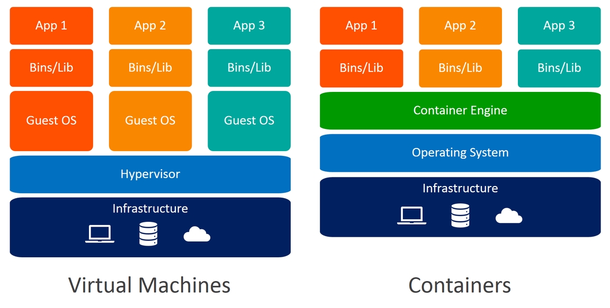
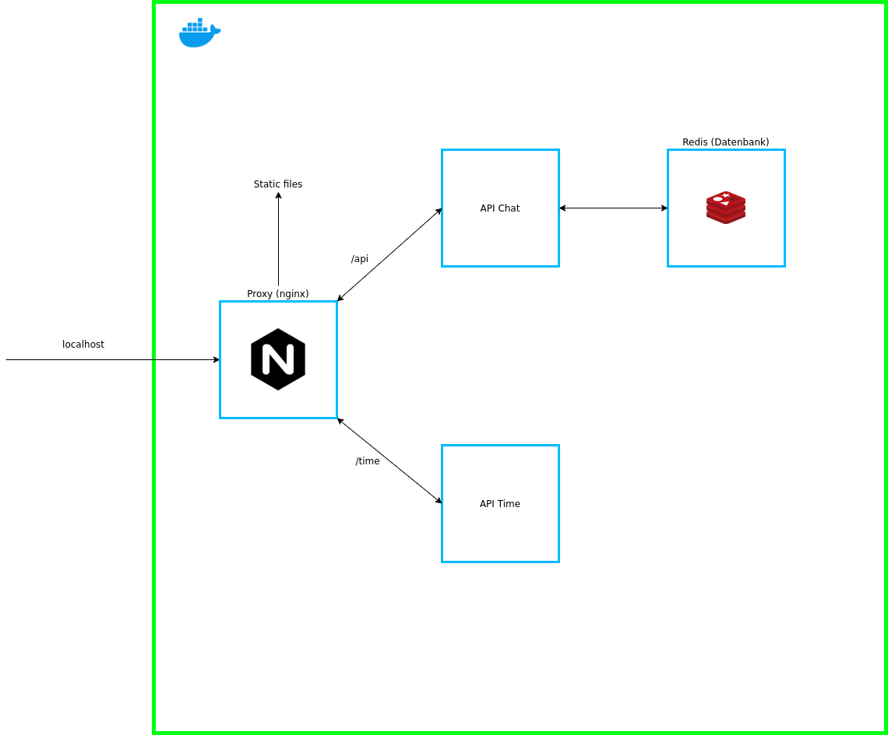

=================
Docker Einführung
=================

Was ist Docker?
===============
Docker ist ein Open Source Tool, mit dem Entwickler und Systemadministratoren ihre Anwendungen einfach in einer Sandbox (Container genannt) bereitstellen können, um sie auf dem Host-Betriebssystem, d. h. Linux, auszuführen. Docker ermöglicht es, Anwendungen von der Infrastruktur zu trennen, sodass Software schnell bereitgestellt werden können. Im Gegensatz zu virtuellen Maschinen haben Container keinen hohen Overhead und ermöglichen daher eine effizientere Nutzung des zugrunde liegenden Systems und der Ressourcen.

`Quelle 1 <https://www.techdivision.com/_Resources/Persistent/46f44554299f5a67e9a85164596390d97611425a/Blogbeitrag2.png>`_

Geschichte
----------
Die ersten Zeilen Code wurden am 19. Januar 2013 von der Firma DotCloud veröffentlicht und erstreckten sich auf über 1146 Zeilen. Die offizielle Veröffentlichung der Software war im März 2013. Die Firma “dotCloud” wurde am 29. Oktober 2013 zu Docker umbenannt.

Container erstellen
-------------------

`Quelle 2 <https://www.claranet.de/sites/all/assets/de/infografik-1_was-sind-container.png>`_

Was ist ein Container?
----------------------
Der heutige Industriestandard ist die Verwendung von virtuellen Maschinen (VMs) zur Ausführung von Softwareanwendungen. VMs führen Anwendungen innerhalb eines Gastbetriebssystems aus, das auf virtueller Hardware läuft, die vom Host-Betriebssystem des Servers betrieben wird.

VMs eignen sich hervorragend für die vollständige Prozessisolierung von Anwendungen: Es gibt nur sehr wenige Möglichkeiten, wie ein Problem im Host-Betriebssystem die im Gast-Betriebssystem laufende Software beeinflussen kann, und umgekehrt. Aber diese Isolation hat ihren Preis: Der Rechenaufwand für die Virtualisierung der Hardware, die ein Gastbetriebssystem nutzen soll, ist beträchtlich.

Container verfolgen einen anderen Ansatz: Indem sie die Low-Level-Mechanik des Host-Betriebssystems nutzen, bieten Container den Großteil der Isolation virtueller Maschinen bei einem Bruchteil der Rechenleistung.

`Quelle 3 <https://www.weave.works/assets/images/bltb6200bc085503718/containers-vs-virtual-machines.jpg>`_

Container erstellen und starten
-------------------------------
Aus Docker Hub ein Container Image herunterladen (in dem Falle alpine:latest):

.. code:: shell

    $ docker pull alpine

.. code:: shell

    $ docker images

Listet alle heruntergeladenen docker images

Erstellen eines Containers:

.. code:: shell

    $ docker create [OPTIONS] IMAGE [COMMAND] [ARG...]

Beispiele:

.. code:: shell

    $ docker create -t -i alpine

Man erhält die Container-ID: 5f2d97a1103716097dbf56ee8435ef5ef0850e3cada5709b82bcb01bd1e0f3e3

Auflisten aller Container:

.. code:: shell

    $ docker ps -a

Container starten:

.. code:: shell

    $ docker start [OPTIONS] CONTAINER [CONTAINER...]
         

Dockerfile
----------
Mit einem Dockerfile lässt sich mit verschiedenen Kommandos ein Container Image erstellen.
`Weiterführender Link <https://docs.docker.com/engine/reference/builder/>`_

Wir möchten nun im folgendem ein kleines Image bauen, was die aktuelle Zeit auf unserem Server als API anbietet.

Dafür haben wir folgenden Code in Golang, der beim Aufruf von <SERVER-IP>:8080/ die aktuelle Zeit des Servers zurückgibt.

.. code-block:: go

    package main
     
    import (
        "fmt"
        "net/http"
        "time"
    )
     
    func main() {
        http.HandleFunc("/", CurrentTime)
        http.ListenAndServe(":8080", nil)
    }
     
    func CurrentTime(w http.ResponseWriter, r *http.Request) {
        fmt.Fprint(w, time.Now().String())
    }
 
Um das Ganze nun in ein Image zu packen, erstellen wir ein Dockerfile:

.. code-block:: yaml

    FROM golang:latest
    WORKDIR /code
    EXPOSE 8080
    COPY . .
    CMD ["go", "run", "main.go"]

In diesem Image haben wir auf dem Container golang:latest aufgebaut, da wir Golang brauchen.
Wir haben unsere working directory definiert, den Port 8080 freigeschalten und unsere main.go Datei in unserer WORKDIR rüberkopiert. Mit CMD starten wir dann unseren Golang Server.

Jetzt wollen wir unser Image erstellen:

.. code:: shell

    $ docker build --tag golang-time .

Und natürlich wollen wir unser Image noch laufen lassen:

.. code:: shell

    $ docker run -p 8080:8080 golang-time

Gehen wir auf unserem Host-System auf localhost:8080 bekommen wir die aktuelle Zeit des Servers.

Docker Compose
==============
Docker Compose ist ein Tool, mit dem man mehrere Docker-Container in einer YAML Datei konfigurieren kann. Alle Docker Container laufen dann isoliert, arbeiten jedoch zusammen und werde auch zusammen gestartet. Das hat den Vorteil, dass man die Container nicht einzeln starten muss wenn alle aufeinander aufbauen oder zusammen arbeiten müssen.

Wir wollen nun ein Nginx Server als Reverse Proxy zu unserem Time Service von vorhin benutzen.

Dafür erstellen wir folgende docker-compose.yaml Datei:

.. code:: yaml

    version: "3.8"
    services:
        time:
            build: ./time
            restart: always
        redis:
            image: redis:latest
            restart: always
            volumes:
                - ./redis-data:/data
        api:
            build: ./api
            restart: always
            links: 
                - redis:redis
        web:
            image: nginx:latest
            restart: always
            volumes:
                - ./nginx/nginx.conf:/etc/nginx/conf.d/default.conf
                - ./website:/var/www/website
            ports:
                - "80:80"
            links: 
                - api:api
    volumes:
        redis-data:
 
| In diesem Docker-Compose File haben wir nun 4 Container:
| 1. Unser Container von vorhin, der uns die Zeit vom Server zurück gibt
| 2. Eine Redis Datenbank
| 3. Eine API, um Nachrichten in die Datenbank zu speichern
| 4. Einen Webserver, der unsere Website anzeigt und einen Proxy zu unseren anderen Containern

Das wäre unsere nginx.conf Datei:

.. code:: yaml

    server {
       root /var/www/website;
       server_name localhost;
     
       location /time/ {
           proxy_pass  http://time:8080/;
       }
     
       location /api/ {
           proxy_pass  http://api:8080/;
       }
    }
 

Wir können nun über localhost unsere Website sehen und über /time oder /api die jeweiligen anderen Container.

.. code:: shell

    $ docker-compose up

Ein Volumen wird für jeden Container erstellt, Docker speichert die Volumen in einen Folder. Erstellt man die Container neu werden aber wieder neue Volumen erstellt.
Das Ganze kann man nun persistent machen, indem man angibt wohin man das Volumen speichert. In unserem Beispiel haben wir bei der Docker-Compose Datei für
unsere Datenbank ein Volumen erstellt, um das gleiche Volumen zu haben, auch wenn wir unsere Container neu erstellen.
Wir speichern unsere ganzen Datenbank Daten in unserem Folder redis-data und verwenden diese beim nächsten Start wieder.

Container vs VM
===============

`Quelle 4 <https://eadn-wc03-4064062.nxedge.io/cdn/wp-content/uploads/2020/05/2020_05_13_12_19_07_PowerPoint_Slide_Show_Azure_AZ104_M01_Compute_ed1_-1024x467.png>`_

Container bieten Prozessisolierung auf Betriebssystemebene, während virtuelle Maschinen Isolierung auf der Hardware-Abstraktionsschicht (d. h. Hardware-Virtualisierung) bieten.  In IaaS-Anwendungsfällen ( sofort nutzbare Computinginfrastruktur) ist die Maschinenvirtualisierung also eine ideale Lösung, während Container am besten für die Verpackung/Auslieferung portabler und modularer Software geeignet sind.

Vorteile Container:

| - Cloud Native Apps lassen sich leichter entwickeln dank der geringen Größe
| - Microservices lassen sich leichter paketieren
| - IT-Projekte lassen sich leicht in eine uneinheitliche IT-Umgebung verschieben, die unter einem gemeinsamen Betriebssystem läuft 

Vorteile VM:

| - Für traditionelle/monolithische Workloads besser geeignet 
| - Infrastrukturressourcen zu provisionieren

Container vs VM Sicherheit
==========================
Sowohl Docker als auch virtuelle Maschinen trennen die Anwendungen voneinander ab.  Das heißt, wenn eine Anwendung betroffen ist, kann dies keine Auswirkungen auf andere Anwendungen haben. Theoretisch bietet dies den perfekten Schutz, aber Docker hat ein grundlegendes Problem: Alle Anwendungen teilen sich ein Betriebssystem. Wenn das Betriebssystem von einer kompromittierten Anwendung durchbrochen wird, könnte ein Angriff alle Container auf einmal betreffen.

Virtuelle Maschinen umgehen dieses Problem, indem sie das Betriebssystem, das zur Steuerung der Anwendung verwendet wird, vom Hypervisor, der mit der Hardware interagiert, getrennt halten. Es gibt ein Betriebssystem, mit dem der Benutzer interagieren kann, um die Anwendung zu nutzen, aber es erlaubt ihm nicht, mit der Hardware zu interagieren. Das bedeutet, dass es extrem unwahrscheinlich ist, dass ein Fehler in einer Anwendung negative Auswirkungen auf die Hardware des Host-Systems hat.

In diesem Sinne bieten virtuelle Maschinen mehr Sicherheit vor Betriebssystemfehlern und Sicherheitslücken als Docker-Container. Das Modell der Anwendungstrennung, das Docker zur Optimierung der Ressourcennutzung verwendet, geht auf Kosten der Sicherheit. Virtuelle Maschinen haben den Vorteil, dass sie das Betriebssystem von der Hardware getrennt halten, um das Risiko von Schäden zu minimieren.

Vorteile und Nachteile von Docker
=================================
Vorteile:

- Schnelle Entwicklung: Es kann die Bereitstellung auf Sekunden reduzieren. Es ist aufgrund der Tatsache, dass es einen Container für jeden Prozess erstellen wird und das ohne OS zu booten.

- Sicherheit: Docker stellt sicher, dass Anwendungen, die auf Containern laufen, aus Sicherheitssicht vollständig voneinander getrennt und isoliert sind, indem es uns die vollständige Kontrolle über den Verkehrsfluss und die Verwaltung gewährt.

- Einfachheit und schnellere Konfigurationen: Die Art und Weise, wie Docker die Dinge vereinfacht, ist einer der Hauptvorteile von Docker. Es gibt den Anwendern die Flexibilität, ihre eigene Konfiguration zu nehmen, diese in den Code zu packen und ihn ohne Probleme weiter zu verteilen. Dabei sind die Anforderungen an die Infrastruktur nicht mehr an die Umgebung der Anwendung gebunden, da Docker in einer Vielzahl von Umgebungen eingesetzt werden kann.

- Container Image Effizienz: Mit Hilfe eines Docker können wir ein Container-Image erstellen und dasselbe Image über jeden Schritt des Bereitstellungsprozesses weiter verwenden. Der Vorteil ist die Möglichkeit, nicht abhängige Schritte zu trennen und sie auch parallel auszuführen. Darüber hinaus kann sich die Zeitdauer vom Build bis zur Produktion deutlich verkürzen.

- Kontinuierliche Integration: Wenn es um Continuous Integration geht, funktioniert Docker gut als Teil der Pipelines zusammen mit Tools wie Travis, Jenkins und Wercker. Diese Tools können die neue Version als Docker-Image speichern. Jedes Mal, wenn unser Quellcode aktualisiert wird, müssen wir ihn nur mit einer Versionsnummer versehen und an Docker Hub pushen, um ihn dann in die Produktion zu überführen.

- Rollback: Mit dem Befehl “docker service rollback [OPTIONS] SERVICE” ist es möglich auf die vorherige Version eines Dienstes zurückzugreifen. Nach dem Ausführen dieses Befehls wird der Dienst auf die Konfiguration zurückgesetzt, die vor dem letzten Befehl zum Aktualisieren des Docker-Dienstes vorhanden war. Dieser Ansatz unterstützt eine agile Entwicklung und sorgt, was die Tools angeht, für eine kontinuierliche Integration und Bereitstellung

- Modularität: Anwendungen können modular und unabhängig voneinander verwendet oder kombiniert werden.

- Overhead: Im Vergleich zu den virtuellen Maschinen haben Docker-Container weniger Overhead. Jedoch hat ein Docker-Container keinen “null” Overhead.

Nachteile:

- Generelle Sicherheitsprobleme: Container sind kein Allheilmittel für die Sicherheit. Da Container in fast allen Fällen einen gemeinsamen Kernel, nämlich den Kernel des Betriebssystems, verwenden, besteht bei einem Angriff auf einen Container auf einem Host in der Regel die Gefahr, dass mehrere Container auf einmal kompromittiert werden. Bei VMs ist dies weniger wahrscheinlich, da jede VM ihr eigenes Betriebssystem verwendet. Da Container relativ neu sind, muss die Technologie erst in bestehende Infrastrukturen integriert werden, damit auch Sicherheitsschichten greifen können.

- Plattformübergreifende Kompatibilität: Das einzige große Problem ist, dass eine Anwendung, die für die Ausführung in einem Docker-Container unter Windows entwickelt wurde, nicht unter Linux ausgeführt werden kann und umgekehrt. Für virtuelle Maschinen gilt diese Einschränkung jedoch nicht. Diese Einschränkung macht Docker also in einigen sehr heterogenen Umgebungen, die sowohl aus Windows- als auch aus Linux-Servern bestehen, weniger attraktiv.

Quellen
=======

* https://docs.docker.com/
* https://docker-curriculum.com/
* https://www.redhat.com/de/topics/containers/what-is-docker
* https://www.upguard.com/blog/docker-vs-vmware-how-do-they-stack-up
* https://devopscon.io/blog/docker/docker-vs-virtual-machine-where-are-the-differences/
* https://security.stackexchange.com/questions/169642/what-makes-docker-more-secure-than-vms-or-bare-metal
* https://www.comparitech.com/net-admin/docker-vs-virtual-machines/
* https://docs.microsoft.com/de-de/virtualization/windowscontainers/about/containers-vs-vm