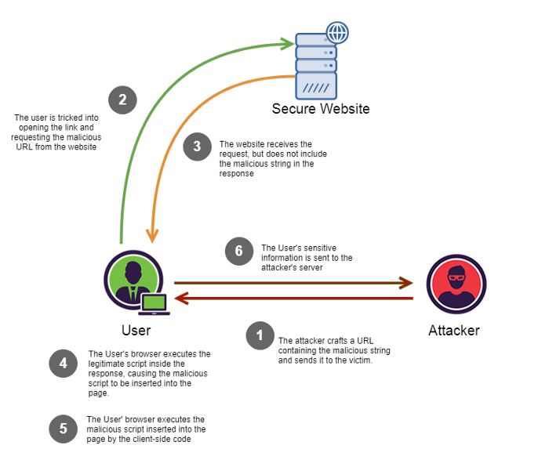

=============
IT-Sicherheit
=============

Injections
==========

CRLF Injection
==============
Bei einem Angriff auf eine CRLF-Injektionsschwachstelle fügt der Angreifer sowohl das Carriage-Return- als auch das Linefeed-Zeichen in 
Benutzereingaben ein, um dem Server, der Webanwendung oder dem Benutzer vorzugaukeln, dass ein Objekt beendet ist und ein anderes begonnen hat. 

Als solche sind die CRLF-Sequenzen keine bösartigen Zeichen, sie können jedoch für bösartige Absichten, für das Aufteilen von HTTP-Antworten usw. 
verwendet werden.

Email (SMTP) Header Injection
=============================
SMTP-Header-Injection-Schwachstellen entstehen, wenn Benutzereingaben ohne ausreichende Bereinigung in E-Mail-Header eingefügt werden, 
wodurch ein Angreifer zusätzliche Header mit beliebigen Werten einfügen kann. 

Dieses Verhalten kann ausgenutzt werden, um Kopien von E-Mails an 
Dritte zu senden, Viren anzuhängen, Phishing-Angriffe auszuführen und oft auch den Inhalt von E-Mails zu verändern. Es wird typischerweise von 
Spammern ausgenutzt, die den Ruf des anfälligen Unternehmens ausnutzen wollen, um ihren E-Mails Legitimität zu verleihen.

Dieses Problem ist besonders gravierend, wenn die E-Mail sensible Informationen enthält, die nicht für den Angreifer bestimmt sind, 
wie z. B. ein Token zum Zurücksetzen des Passworts.

HTTP Host Header Injection
==========================
HTTP-Host-Header-Angriffe nutzen anfällige Websites aus, die den Wert des Host-Headers auf unsichere Weise behandeln. Wenn der Server dem Host-Header 
implizit vertraut und ihn nicht richtig validiert oder entschlüsselt, kann ein Angreifer diese Eingabe verwenden, um schädliche Nutzdaten zu injizieren, 
die das serverseitige Verhalten manipulieren. Angriffe, bei denen eine Nutzlast direkt in den Host-Header injiziert wird, werden oft als 
"Host-Header-Injection"-Angriffe bezeichnet.

Standard-Webanwendungen wissen in der Regel nicht, in welcher Domäne sie eingesetzt werden, es sei denn, diese wird bei der Einrichtung manuell in 
einer Konfigurationsdatei angegeben. Wenn sie die aktuelle Domain wissen müssen, um z. B. eine absolute URL in einer E-Mail zu generieren, 
können sie die Domain aus dem Host-Header abrufen:

.. code::

    <a href="https://_SERVER['HOST']/support">Kontaktieren Sie den Support</a>

Der Header-Wert kann auch in einer Vielzahl von Interaktionen zwischen verschiedenen Systemen der Infrastruktur der Website verwendet werden.

Da der Host-Header eigentlich vom Benutzer steuerbar ist, kann diese Praxis zu einer Reihe von Problemen führen. Wenn die Eingabe nicht 
ordnungsgemäß escaped oder validiert wird, ist der Host-Header ein potentieller Vektor für die Ausnutzung einer Reihe anderer Schwachstellen, 
vor allem:

- Web-Cache-Vergiftung
- Fehler in der Geschäftslogik in bestimmten Funktionen
- Routing-basierte SSRF
- Klassische serverseitige Schwachstellen, wie z. B. SQL-Injection

OS Command Injection
====================
OS Command Injection ist ein Angriff, bei dem das Ziel die Ausführung beliebiger Befehle auf dem Host-Betriebssystem über eine anfällige Anwendung ist. 

OS Command Injection Angriffe sind möglich, wenn eine Anwendung unsichere Daten (Formulare, Cookies, HTTP-Header usw.) an das zugrundeliegende 
Betriebssystem übergibt. Bei diesem Angriff werden die vom Angreifer bereitgestellten Betriebssystembefehle normalerweise mit den 
Berechtigungen der verwundbaren Anwendung ausgeführt. Command Injection Angriffe sind weitgehend auf unzureichende Eingabevalidierung zurückzuführen.

.. image:: ./img/os-command-injection.svg
    :alt: OS Command Injection

Cross-Site-Scripting
====================

Cross-Site-Scripting (auch als XSS bekannt) ist eine Web-Sicherheitslücke, die es einem Angreifer ermöglicht, die Interaktionen von Benutzern 
mit einer anfälligen Anwendung zu beeinträchtigen. Es ermöglicht dabei die Richtlinie für den gleichen Ursprung zu umgehen, die dazu dient, 
verschiedene Websites voneinander abzugrenzen. Cross-Site-Scripting-Schwachstellen erlauben es einem Angreifer normalerweise, sich als 
Benutzer des Opfers auszugeben, alle Aktionen auszuführen, die der Benutzer ausführen kann, und auf alle Daten des Benutzers zuzugreifen. 
Wenn der Benutzer des Opfers über privilegierten Zugriff innerhalb der Anwendung verfügt, kann der Angreifer möglicherweise die vollständige 
Kontrolle über alle Funktionen und Daten der Anwendung erlangen.

Wie funktioniert XSS?
---------------------
Cross-Site-Scripting funktioniert, indem eine anfällige Website so manipuliert wird, dass sie bösartiges JavaScript an Benutzer zurückgibt. 
Wenn der bösartige Code im Browser eines Opfers ausgeführt wird, kann der Angreifer dessen Interaktion mit der Anwendung vollständig 
beeinträchtigen.

Was sind Arten von XSS-Angriffen?
---------------------------------
- Reflected XSS: Bösartiges Skript, welches aus der aktuellen HTTP-Anfrage stammt.
- Stored XSS: Das bösartige Skript stammt aus der Datenbank der Website.
- DOM-based XSS: Die Schwachstelle befindet sich im Client-seitigen Code und nicht im Server-seitigen Code.

Reflected cross-site scripting
------------------------------
Reflektiertes XSS ist die einfachste Variante des Cross-Site-Scripting. Sie tritt auf, wenn eine Anwendung Daten in einer HTTP-Anfrage 
empfängt und diese Daten auf unsichere Weise in die unmittelbare Antwort einfügt.

.. image:: ./img/1_o_asKsD_JqunhqggHoxodw.png
    :alt: XSS Reflected

Stored cross-site scripting
---------------------------
Gespeicherte XSS (auch bekannt als persistentes oder XSS zweiter Ordnung) tritt auf, wenn eine Anwendung Daten von einer nicht 
vertrauenswürdigen Quelle erhält und diese Daten auf unsichere Weise in ihre späteren HTTP-Antworten einfügt.

Die fraglichen Daten können über HTTP-Anfragen an die Anwendung übermittelt werden, z. B. Kommentare zu einem Blog-Beitrag, 
Benutzer-Nicknames in einem Chat-Room oder Kontaktangaben zu einer Kundenbestellung. In anderen Fällen können die Daten von anderen nicht 
vertrauenswürdigen Quellen kommen, z. B. von einer Webmail-Anwendung, die über SMTP empfangene Nachrichten anzeigt, von einer 
Marketing-Anwendung, die Beiträge in sozialen Medien anzeigt, oder von einer Netzwerküberwachungsanwendung, die Paketdaten aus dem 
Netzwerkverkehr anzeigt.

DOM-based cross-site scripting
------------------------------
DOM-basiertes XSS (auch bekannt als DOM XSS) tritt auf, wenn eine Anwendung ein clientseitiges JavaScript enthält, 
das Daten aus einer nicht vertrauenswürdigen Quelle auf unsichere Weise verarbeitet, in der Regel durch Zurückschreiben der Daten in das DOM.

Code Injection
==============
Code Injection ist der allgemeine Begriff für Angriffsarten, die darin bestehen, Code zu injizieren, der dann von der Anwendung 
interpretiert/ausgeführt wird. Diese Art von Angriff nutzt den schlechten Umgang mit nicht vertrauenswürdigen Daten aus, was in der Regel 
auf das Fehlen einer ordnungsgemäßen Validierung von Ein- und Ausgabedaten zurückgeführt werden kann.

Code Injection unterscheidet sich von Command Injection dadurch, dass ein Angreifer nur durch die Funktionalität der injizierten Sprache 
selbst begrenzt ist. 

Wenn ein Angreifer in der Lage ist, PHP-Code in eine Anwendung zu injizieren und ausführen zu lassen, ist er nur durch 
die Möglichkeiten von PHP begrenzt. Command Injection besteht darin, vorhandenen Code auszunutzen, um Befehle auszuführen, normalerweise im 
Kontext einer Shell.

SQL Injection
=============

Bei einer SQL-Injection handelt es sich um das Einschleusen von fremden SQL-Code in eine Datenbank. Dies wird ermöglicht, 
wenn die Eingabe eines Nutzers einer Website direkt in eine Datenbankabfrage eingefügt wird und nicht vorher validiert wird oder ein 
Teil der Datenbankabfrage in der URL hinterlegt ist und diese somit veränderbar ist. Dadurch kann ein unbefugter Nutzer auf die Datenbank 
zugreifen, sie modifizieren (bzw. löschen) oder auslesen.

Je nach konkretem Anwendungsfall können dadurch

- persönliche Nutzerdaten abgegriffen werden (z.B. Passwörter)
- Authentifikations-Prozesse umgangen werden
- Daten geändert oder gelöscht werden.

Eine Unterart der SQL-Injection ist die Blind SQL-Injection, bei welcher der Angreifer keine Ausgabe vom angegriffenen System bekommt. 
Trotzdem ist es mit etwas mehr Aufwand möglich, durch eine Blind SQL-Injection erheblichen Schaden anzurichten.

Mögliche Gegenmaßnahmen sind die Überprüfung von Benutzereingaben vor dem Weiterleiten an die Datenbank, Nutzung von Escape-Characters 
um Eingaben, die als Datenbank-Zugriffe missinterpretiert werden können, zu verhindern oder die Nutzung von Prepared Statements. 

.. image:: ./img/sql-injection.svg
    :alt: SQL Angriff

Quellen
=======

* https://portswigger.net/web-security/os-command-injection
* https://www.netsparker.com/blog/web-security/crlf-http-header/
* https://portswigger.net/kb/issues/00200800_smtp-header-injection
* https://portswigger.net/web-security/host-header
* https://security.lauritz-holtmann.de/post/sso-security-crlf-injection/
* https://www.wordfence.com/learn/how-to-prevent-cross-site-scripting-attacks/
* https://medium.com/iocscan/reflected-cross-site-scripting-r-xss-b06c3e8d638a
* https://www.imperva.com/learn/application-security/cross-site-scripting-xss-attacks/
* https://medium.com/iocscan/dom-based-cross-site-scripting-dom-xss-3396453364fd
* https://www.wordfence.com/wp-content/uploads/2015/11/SQL-Injection.png
* https://portswigger.net/web-security/sql-injection