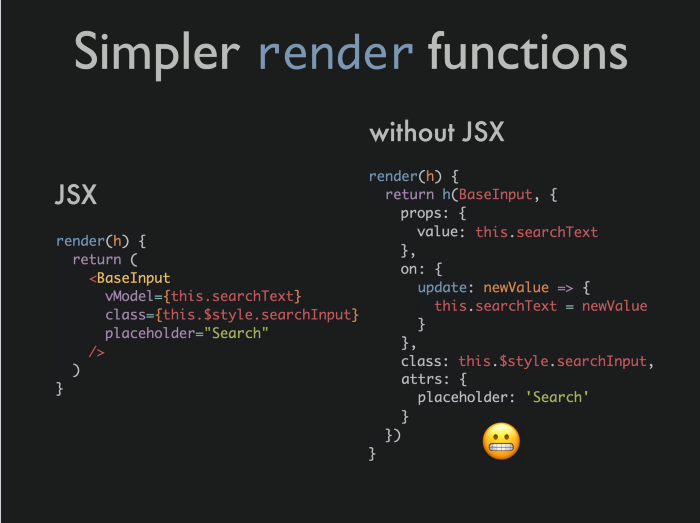
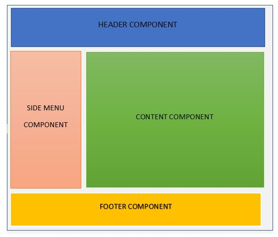

=====
React
=====

JSX
===
Mit JSX lassen sich HTML Elemente in ein Javascript Objekt speichern:

.. code-block::

  export const Title = <h1>Mein Titel</h1>;

Gleichzeitig lässt sich aber auch Javascript Code in HTML Elemente einbinden, indem man den Code in {} setzt:

.. code-block::

  const titleName = "Mein Titel";
  export const Title = <h1>{titleName}</h1>;

Oder auch Javascript Code ausführen lassen:

.. code-block::

  export const AlertButton = <button onClick={() => alert("Hello Welt")}>Alert</button>;

Arrow Function
==============
Mit Pfeilfunktionen lassen sich Funktionen kompakter schreiben.
Folgende Funktion:

.. code-block:: javascript

  function greeting(name) {
    alert("Hello " + name);
  }

Lässt sich kürzer schreiben:

.. code-block:: javascript

  const greeting = (name) => alert("Hello " + name);

Dabei ist diese Zeile gleichzeitig auch ein return:

.. code-block:: javascript

  const getOne = () => 1;

Hier würde man eine 1 zurück erhalten, wenn man getOne() aufruft.

Es ist außerdem auch möglich einen Block zu definieren:

.. code-block:: javascript

  const alertAndLog = (name) => {
    alert("Hello " + name);
    console.log("Hello " + name);
  };

React Component
===============

Mit React lassen sich Komponenten erstellen, diese können dann wie ein HTML Element aufgerufen werden und auch wiederverwendet werden.

Wenn wir eine Komponente Text definieren und als value Parameter einen String haben wollen, dann können wir diese Komponente so erstellen:

.. code-block::

  <Text value="MyText"/>

Die Attribute werden dabei als ein props Objekt an die Komponente übergeben. Die Komponente hat also einen Parameter props und kann unser value mit props.value erhalten.

Function based Component
------------------------

Komponenten lassen sich als Funktionen definieren, der Return-Wert ist dabei der Inhalt, der angezeigt werden soll:

.. code-block::

  function Text(props) {
    return <>{props.value}</>;
  }

Oder noch einfacher mit einer Arrow Funktion:

.. code-block::

  const Text = (props) => <>{props.value}</>;

Class based Component
---------------------

Bei einer Klassenkomponente muss man eine render Funktion implementieren und die Klasse React.Component erben.

.. code-block::

  class Text extends React.Component {
    render() {
      return <>{this.props.value}</>;
    }
  }

Lifecycle
=========

.. image:: ./img/NpWCjYyzfnJkn7rXwDmyWwK2DqInFJu6-g1O.png
    :alt: Lifecycle

Der Lebenszyklus einer Klassenkomponente ist oben dargestellt. Diese werden beim Auftreten aufgerufen und können so als Methoden implementiert werden, welche aufgerufen werden sollen.

State/Props update ist dabei sehr interessant, da React die Props und den State überwacht und bei Änderungen die jeweilige shouldComponentUpdate() Methode aufruft. 
Diese Methode liefert einen Boolean zurück, ob die Komponente geupdatet werden soll.

Hooks
=====

Mit React 16.8 wurde ein neues Konzept eingeführt: React-Hooks sind Funktionen, die es ermöglicht, den Lebenszyklus von React-Komponenten anzuzapfen, ohne die Klassensyntax zu verwenden oder Lifecycle-Methoden direkt aufzurufen. 
Anstatt eine Klasse zu deklarieren, schreibt man eine Render-Funktion.

Der Aufruf eines Hooks führt im Allgemeinen Seiteneffekte ein - Effekte, die es Komponenten erlauben, sich in Dinge wie den Komponentenzustand und I/O einzuklinken. 
Ein Seiteneffekt ist jede außerhalb der Funktion beobachtbare Zustandsänderung außer dem Rückgabewert der Funktion.

- Komponenten schreiben als Funktionen statt als Klassen.
- Bessere Organisation von Code
- Wiederverwendbare Logik zwischen verschiedenen Komponenten möglich
- Hooks nicht aufrufen innerhalb von:
    * Schleifen
    * Bedingungen
    * verschachtelten Funktionen
- Sie dürfen nicht aus normalen JavaScript Funktionen aufgerufen werden -> Nur React-Funktionskomponenten

useEffect
---------

Der Effekt-Hook, useEffect, fügt die Möglichkeit hinzu, Seiteneffekte von einer Funktionskomponente aus durchzuführen.
Wenn Sie useEffect aufrufen, teilen Sie React mit, dass Ihre "Effekt"-Funktion ausgeführt werden soll, nachdem die Änderungen in das DOM übertragen wurden. 
Effekte werden innerhalb der Komponente deklariert, so dass man Zugriff auf deren props und state hat. Standardmäßig führt React die Effekte nach jedem Rendering aus.

.. code-block::

    import React, { useState, useEffect } from 'react';
    function Example() {
      const [count, setCount] = useState(0);
      
      
      useEffect(() => {    
          document.title = `You clicked ${count} times`;  
      });
      return (
          

            
You clicked {count} times

            <button onClick={() => setCount(count + 1)}>
                Click me
            </button>
          

      );
    }

ReactDOM.render()
=================

Mit ReactDOM.render() lässt sich eine Komponente erstellen und zu einem HTML-Element einbinden.
In den meisten Fällen hat man dann die Rootkomponente und ein div Element mit der id root:

.. code-block:: javascript

    ReactDOM.render(
      <Rootkomponente/>,
      document.getElementById("root")
    );

React Vorteile
==============

Single Page App
---------------

Eine Single-Page-Applikation ist eine Webanwendung oder Website, die mit dem Benutzer interagiert, indem sie die aktuelle Webseite mit neuen Daten vom Webserver dynamisch umschreibt, anstatt die Standardmethode eines Webbrowsers, der ganze neue Seiten lädt. 
Das Ziel sind schnellere Übergänge, durch die sich die Website mehr wie eine native App anfühlt.

React virtual DOM
-----------------

.. image:: ./img/2dom.png
    :alt: React virtual DOM

In React gibt es für jedes DOM-Objekt ein entsprechendes "virtuelles DOM-Objekt". Ein virtuelles DOM-Objekt ist eine Repräsentation eines DOM-Objekts, wie eine leichtgewichtige Kopie.

Ein virtuelles DOM-Objekt hat die gleichen Eigenschaften wie ein reales DOM-Objekt, aber es fehlt die Fähigkeit des realen Objekts, direkt zu verändern, was auf dem Bildschirm angezeigt wird.

Das Manipulieren des DOM ist langsam. Die Manipulation des virtuellen DOMs ist viel schneller, weil nichts auf dem Bildschirm gezeichnet wird. 

Bei jedem Rendern einer JSX Componente wird der komplette virtuelle DOM geupdatet. Anschließend wird der virtuelle DOM mit dem vorherigen verglichen
und es werden nur die Elemente im richtigen DOM geupdatet, die sich verändert haben. 

Dadurch ist React ziemlich schnell.

Quellen
=======

* https://www.w3schools.com/react/
* https://reactjs.org/
* https://reactjs.org/docs/getting-started.html
* https://agm1984.medium.com/how-to-use-jsx-with-laravel-and-vue-with-laravel-mix-e1061aab1b6b
* https://csharpcorner.azureedge.net/article/react-introduction-advantages-and-disadvantages/Images/2.%20Component.JPG
* https://www.kirupa.com/react/images/single_page_model_144.png
* https://www.freecodecamp.org/news/how-to-understand-a-components-lifecycle-methods-in-reactjs-e1a609840630/
* https://cdn-media-1.freecodecamp.org/images/NpWCjYyzfnJkn7rXwDmyWwK2DqInFJu6-g1O
