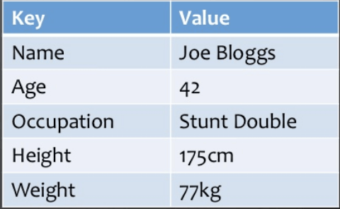
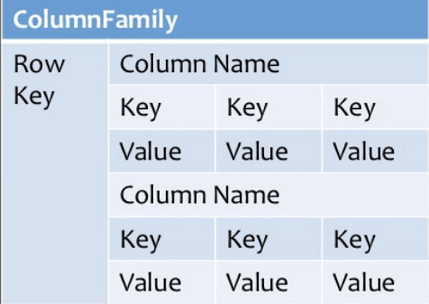
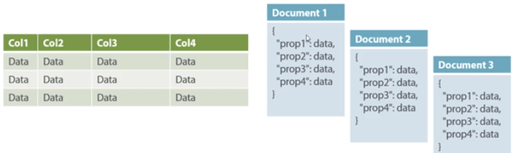
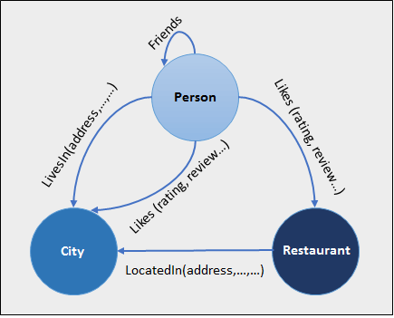
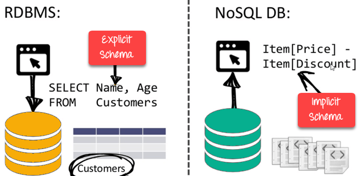
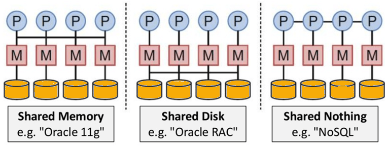
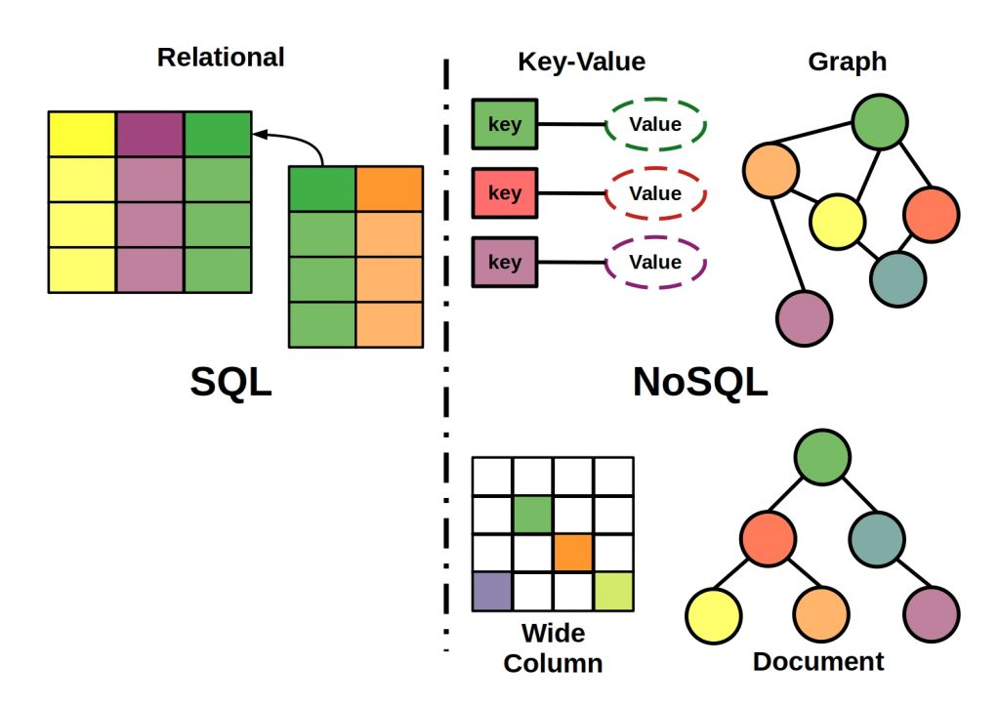

=============
SQL vs. NoSQL
=============

SQL-Datenbanken
===============

SQL-Datenbanken verwenden SQL (Structured Query Language) zum Definieren und Bearbeiten von Daten. Einerseits ist dies äußerst leistungsfähig: SQL ist eine der vielseitigsten und am weitesten verbreiteten verfügbaren Optionen. Dies macht es zu einer sicheren Wahl und eignet sich besonders für komplexe Abfragen. Andererseits kann es einschränkend sein. SQL erfordert, dass man vordefinierte Schemata verwenden muss, um die Struktur der Daten zu bestimmen, bevor damit gearbeitet wird. Darüber hinaus müssen alle Daten der gleichen Struktur folgen. Dies kann eine erhebliche Vorbereitung erfordern.

Was ist eine SQL-Datenbank?
===========================

SQL-Datenbanken unterstützen SQL - eine domänenspezifische Sprache zum Abfragen und Manipulieren von Daten in einer relationalen Datenbank. Das "relationale" in einer relationalen Datenbank bezieht sich auf das "relationale Modell" der Datenverwaltung.

Der Schlüssel zum relationalen Modell ist die Abstraktion von Daten als eine Menge von Tupeln, die in Relationen organisiert sind, was eine Abstraktion über die physische Darstellung von Daten und Zugriffspfaden ermöglicht.

Die Skalierbarkeit
==================

In den meisten Situationen sind SQL-Datenbanken vertikal skalierbar. Dies bedeutet, dass die mögliche Auslastung eines einzelnen Servers erhöht werden kann, indem beispielsweise CPU, RAM oder SSD erhöht wird. NoSQL-Datenbanken sind dagegen horizontal skalierbar. Dies bedeutet, dass sie mehr Datenverkehr verarbeiten, indem sie Sharding durchführen oder mehr Server in ihre NoSQL-Datenbank aufnehmen. Es ist, als würde man dem gleichen Gebäude mehr Stockwerke hinzufügen, anstatt der Nachbarschaft mehr Gebäude hinzuzufügen. Letzteres kann letztendlich größer und leistungsfähiger werden, sodass NoSQL-Datenbanken die bevorzugte Wahl für große oder sich ständig ändernde Datenmengen sind.

SQL-Datenbanken - Vor- und Nachteile
====================================

Vorteile:

-  Geringerer Datenspeicherbedarf aufgrund von Normalisierung und anderen Optimierungsmöglichkeiten. Führt oft zu einer besseren Leistung und effizienteren Nutzung von Ressourcen.
- Starke Datenintegrität durch ACID (Atomicity, Consistency, Isolation, Durability).
- Standardzugriff auf Daten über SQL.
- Generell flexiblere Abfrageunterstützung, die ein breiteres Spektrum an Workloads bewältigen kann.

Nachteile:

- Starre Datenmodelle, die ein sorgfältiges Design im Vorfeld erfordern, um eine angemessene Leistung zu gewährleisten und einer Weiterentwicklung zu widerstehen - die Änderung eines Schemas ist oft mit Ausfallzeiten verbunden
- Die horizontale Skalierung ist eine Herausforderung

Beispiele für SQL-Datenbanken
=============================

- PostgreSQL
- MySQL
- Oracle
- SQL Server
- CockroachDB

Was ist eine NoSQL-Datenbank?
=============================

NoSQL-Datenbanken verfügen dagegen über dynamische Schemata für unstrukturierte Daten und Daten werden auf verschiedene Arten gespeichert: Sie können spaltenorientiert, dokumentenorientiert, grafisch oder als Key-Value-Speicher organisiert sein. Diese Flexibilität bedeutet:

- Sie können Dokumente erstellen, ohne zuvor deren Struktur definieren zu müssen
- Jedes Dokument kann eine eigene Struktur haben
- Die Syntax kann von Datenbank zu Datenbank variieren
- Sie können flexibel Felder hinzufügen

Verschiedene Typen von NoSQL-Datenmodellen
==========================================

Key-Value-Pair-Based
---------------------

Die Daten werden in Schlüssel/Wert-Paaren gespeichert, vergleichbar zu Hashtabellen/Maps/Dictionaries aus Programmiersprachen.

Column-Based
------------

Spaltenorientierte Datenbanken arbeiten mit Spalten statt Zeilen. Jede Spalte wird separat behandelt.
Sie liefern eine hohe Leistung bei Aggregationsabfragen wie SUM, COUNT, AVG, MIN usw., da die Daten leicht in einer Spalte verfügbar sind.

Document-Oriented
-----------------

Bei einer Dokument-orientierten NoSQL Datenbank wird das Dokument meistens im JSON-Format gespeichert. Ein Dokument hat dabei keine feste Struktur.

Graph-Based
-----------

Bei Graphdatenbanken werden Daten als Knoten angesehen und Beziehungen in Kanten. Das Durchlaufen von Beziehungen ist dadurch schnell, da sie bereits in der DB erfasst sind und nicht erst berechnet werden müssen.
Graphbasierte Datenbanken werden meist für soziale Netzwerke, Logistik und räumliche Daten verwendet.

NoSQL-Datenbanken
=================
Vorteile:

- **Flexibilität:** NoSQL-Datenbanken bieten in der Regel flexible Schemata, die eine schnellere und iterativere Entwicklung ermöglichen. Das flexible Datenmodell macht NoSQL-Datenbanken ideal für halbstrukturierte und unstrukturierte Daten.

- **Skalierbarkeit:** NoSQL-Datenbanken sind in der Regel so konzipiert, dass sie durch die Verwendung von verteilten Hardware-Clustern skaliert werden können, anstatt durch das Hinzufügen teurer und robuster Server. Einige Cloud-Provider wickeln diese Vorgänge hinter den Kulissen als vollständig gemanagten Service ab.

- **Leistungsstark:** NoSQL-Datenbanken sind für bestimmte Datenmodelle und Zugriffsmuster optimiert, die eine höhere Leistung ermöglichen, als wenn Sie versuchen, ähnliche Funktionen mit relationalen Datenbanken zu erzielen.

- **Hochfunktionell:** NoSQL-Datenbanken bieten hochfunktionelle APIs und Datentypen, die speziell für jedes jeweilige Datenmodell entwickelt wurden.

Nachteile:

- **Kein ACID:**  NoSQL-Datenbanken haben nicht die Zuverlässigkeitsfunktionen, die die relationalen Datenbanken haben.
- **Unvollständige** Inkompatibilität mit SQL: Die Query-Abfragen müssen manuell implementiert werden.

Beispiele für NoSQL-Datenbanken
===============================

- Redis
- CouchDB
- MongoDB
- Elasticsearch
- Cassandra

SQL vs. NoSQL
=============

Wann sollte man SQL verwenden?
==============================

- ACID (Datenintegrität)
- Wenige Änderungen am Datenmodell
- Komplexe Relationen zwischen Daten

Wann sollte man NoSQL verwenden?
================================

- Sehr flexible Datenmodelle
- Key-Value Speicher
- Sehr hohe Skalierbarkeit
- Datenintegrität nicht das Wichtigste

Quellen
=======

* https://www.ibm.com/cloud/blog/sql-vs-nosql
* https://hevodata.com/learn/sql-vs-nosql-databases-5-critical-differences/
* https://www.geeksforgeeks.org/difference-between-sql-and-nosql/
* https://www.guru99.com/sql-vs-nosql.html
* https://ceonaires.com/nosql-datenbanken-cloud/
* https://www.mongodb.com/nosql-explained/
* https://www.xplenty.com/blog/the-sql-vs-nosql-difference/
