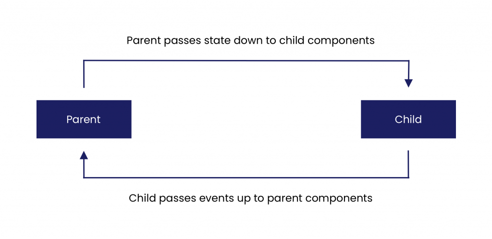
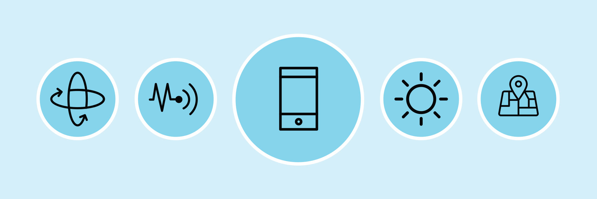
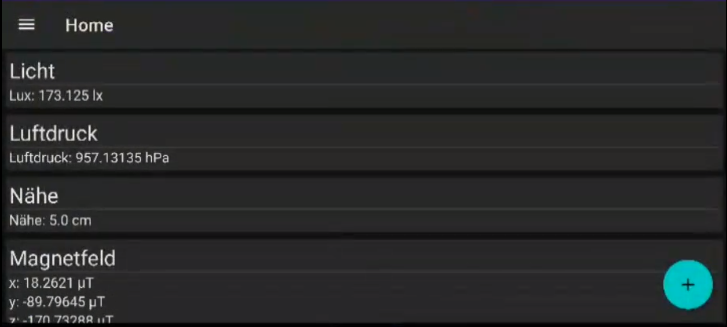
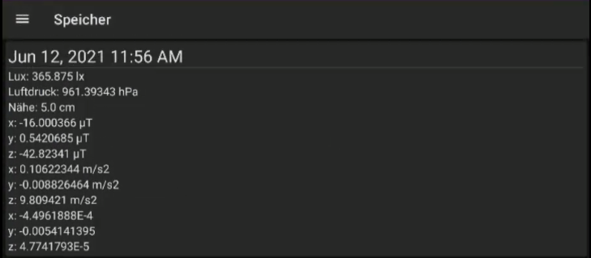

=======
Android
=======

.. image:: ./img/Android_logo_2019_(stacked).svg.png
    :width: 250px
    :align: center
    :height: 200px
    :alt: Kotlin

Kotlin
=======

.. image:: ./img/pic2.png
    :width: 200px
    :align: center
    :height: 100px
    :alt: Kotlin

Kotlin ist eine allgemeine, freie, quelloffene und statisch typisierte "pragmatische" Programmiersprache, die ursprünglich für die JVM (Java Virtual Machine) und Android entwickelt wurde und sowohl objektorientierte als auch funktionale Programmiereigenschaften kombiniert.
Kotlin entstand 2010 bei JetBrains und ist seit 2012 Open Source.

Kotlin Function Parameter Schreibweise
--------------------------------------

.. code:: kotlin

    fun withRandomNumber(myFunction: (Int) -> Unit) {
        myFunction((1..5).random())
    }

Die Funktion kann auf verschiedene Weise aufgerufen werden.

- Funktionsübergabe als Parameter wie man es aus vielen verschiedenen Programmiersprachen kennt:

.. code:: kotlin

    withRandomNumber({number ->
       println(number)
    })

- Der letzte Parameter einer Funktion (welcher selber eine Funktion ist) kann aber auch folgendermaßen übergeben werden:

.. code:: kotlin

    withRandomNumber { number ->
      println(number)
    }

Kotlin Scoped Function/Builder
------------------------------

Es lässt sich außerdem ein Scope für einen Funktionsparameter definieren.
Ein Beispiel dafür wäre die bereits vorgeschriebene apply Methode, die Kotlin für jedes Objekt bereitstellt.
Dabei haben wir dann in dem apply Block einen anderen Scope, nämlich den vom Objekt, auf dem wir das anwenden.

.. code:: kotlin

    class Person(var name: String? = null)

    fun main() {
       val person = Person().apply {
           this.name = "Peter"
       }
    }

Das kann man dann noch erweitern, indem jede Person noch eine Anzahl an Kindern hat.
Mit der Methode child übergeben wir eine Funktion als Parameter namens init und erhalten dann den Scope eines neuen Person-Objektes (dem Kind).

.. code:: kotlin

    class Person(var name: String? = null, val children: MutableList<Person> = ArrayList()) {
       fun child(init: Person.() -> Unit) = Person().apply(init).also {
          children.add(it)
       }
    }

    fun main() {
       val person = Person().apply {
          name = "Peter"
          child {
              name = "Frank"
              child {
                  name = "Linda"
              }
              child {
                  name = "Linda2"
              }
              child {
                  name = "Linda3"
              }
          }
      }
    }

Das Ganze lässt sich dann auf andere Builder übertragen, zum Beispiel auf eine HTML Struktur, die ebenfalls eine Baumstruktur hat.

Kotlin Vorteile
===============

1. Kürzeres Programm für dieselbe Aufgabe
---------------------------------------------

Kotlin ist eine statisch-typisierte Sprache, die sehr einfach zu lesen und zu schreiben ist. Sie hat einen viel einfacheren und kürzeren Code als Java für dasselbe Problem. Da dies die Sprache für den Menschen lesbarer macht, ist sie auch leichter zu debuggen. Der Code von Kotlin ist im Vergleich zu Java viel kleiner und rationalisiert den Programmierprozess.

2. Einfacher Code
------------------

Kotlin-Programme benötigen keine Semikolons in einem Programm. Das macht die Programme einfach zu lesen und zu verstehen. Außerdem gibt es intelligente Casts und String-Templates.
Java ist keine prägnante Sprache. Ein solcher Sprachcode erhöht die Wahrscheinlichkeit von Bugs. Wenn der Code in einer prägnanten Sprache vorliegt, ist die Wahrscheinlichkeit von Fehlern sowohl zur Laufzeit als auch zur Kompilierzeit geringer. Kotlin bietet eine einfache Möglichkeit, mutable und immutable Deklarationen für verschiedene Datenstrukturen zu verwenden.

3. Java-Kompatibilität
---------------------------

Kotlin kann auf einfache Weise Informationen aus Java austauschen und auf vielfältige Weise nutzen. Dies ist einer der größten Vorteile von Kotlin. Java- und Kotlin-Code können im selben Projekt koexistieren, da Kotlin gut mit Java zusammenspielt. Außerdem können eine Reihe von Java-Bibliotheken in Kotlin-Projekten verwendet werden, was die Kompatibilität noch erhöht.

Nicht nur die Bibliotheken, sondern auch viele Frameworks aus Java sind mit Kotlin kompatibel, darunter auch einige fortgeschrittene Frameworks. Man kann Kotlin von Java aus verwenden, ohne große Schritte wie die Konvertierung eines ganzen Projekts nach Kotlin tätigen zu müssen. Dies ist ein großer Vorteil für Entwickler, da man sich nicht wirklich drastisch in eine neue Sprache einarbeiten muss. Jeder, der Java kennt, wird mit Kotlin vertraut sein und in der Lage sein, darin zu programmieren. Java nach Kotlin zu übersetzen ist einfach. In IntelliJ oder Android Studio ist lediglich ein Kotlin-Plugin erforderlich, um Java nach Kotlin zu übersetzen. Dies geschieht auch per Copy-Paste.

4. Eliminieren von Null-Referenzen
------------------------------------

Einer der größten Vorteile von Kotlin gegenüber Java sind die Null-Referenzen. In Java kann jede Objekt Referenz auch null sein, welches einen NullPointerException werfen würde. In Kotlin ist dies nicht möglich, dafür muss der Entwickler das Objekt als nullable definieren.

Android Compose
===================

.. image:: ./img/pic3.png
    :width: 200px
    :align: center
    :height: 200px
    :alt: Kotlin

Jetpack Compose ist ein modernes Toolkit für die Erstellung nativer Android UI. Es basiert auf dem deklarativen Programmiermodell, sodass man einfach beschreiben kann, wie die UI aussehen soll, und Compose kümmert sich um den Rest - wenn sich der Zustand der App ändert, wird die UI automatisch aktualisiert. Da es auf Kotlin aufbaut, ist es vollständig interoperabel mit der Programmiersprache Java und hat direkten Zugriff auf alle Android- und Jetpack-APIs. Es ist kompatibel mit dem bestehenden UI-Toolkit, sodass man klassische und neue Ansichten mischen und anpassen kann, und es ist von Anfang an mit Material Design und Animationen konzipiert.

Hello World
--------------

Mit Compose kann man eine Benutzeroberfläche erstellen, indem man eine Reihe zusammensetzbarer Funktionen definiert, die Daten aufnehmen und UI-Elemente ausgeben. Ein einfaches Beispiel ist ein Greeting Widget, welches eine Begrüßungsnachricht anzeigt.

.. code:: kotlin

    @Composable
        fun Greeting(name: String) {
            Text("Hello $name")
        }

- Die Funktion wird mit der @Composable Annotation annotiert. Alle Composable-Funktionen müssen diese Annotation haben. Die Annotation informiert den Compiler, dass diese Funktion Daten in eine Benutzeroberfläche konvertieren soll.

- Die Funktion nimmt dabei ein Parameter name Daten auf. Composable-Funktionen können Parameter akzeptieren, die es der App-Logik ermöglichen, die Benutzeroberfläche zu beschreiben. In diesem Fall akzeptiert unsere Composable einen String, damit der Benutzer mit seinem Namen begrüßt werden kann.

- Die Funktion zeigt Text in der Benutzeroberfläche an. Dies geschieht durch den Aufruf der Composable-Funktion Text(), die dann das Text-UI-Element erstellt. Die UI-Hierarchie ist durch die jeweiligen Composable Funktionsaufrufe definiert.

- Die Funktion gibt nichts zurück, da Compose-Funktionen nur den den UI Zustand beschreiben und keine UI-Widgets erstellen.

mutableStateOf
-------------------

.. code:: kotlin

    @Composable
    fun Counter() {
       var count by mutableStateOf(0)
       Button({ count++ }) {
           Text("Current Counter value: $count")
       }
    }

Unidirectional Data Flow
------------------------

Unsere Counter Komponente könnten wir noch verbessern, indem wir uns den State übergeben lassen und das Inkrementieren als Funktion aufrufen:

.. code:: kotlin

    @Composable
    fun Counter(count: Int, increment: () -> Unit) {
       Button(increment) {
           Text("Current Counter value: $count")
       }
    }

Dadurch ist die Komponente nicht verantwortlich für den State, sondern überlässt es dem Aufrufer.

Room Database
=============

.. image:: ./img/pic5.png
    :alt: Kotlin

Mit Room kann man die Vorgänge zum Erstellen, Lesen, Aktualisieren und Löschen auf dieselbe Weise wie in der SQLite-API mit weniger Ausführlichkeit ausführen.

- Room bietet eine Abstraktionsschicht über SQLite, um einen fließenden Datenbankzugriff zu ermöglichen und gleichzeitig die volle Leistung von SQLite zu nutzen.

- Mithilfe der Bibliothek kann man einen Cache mit den Daten der App auf einem Gerät erstellen, auf dem die App ausgeführt wird. Dieser Cache ermöglicht es Benutzern eine konsistente Kopie der wichtigsten Informationen in der App anzuzeigen, unabhängig davon, ob Benutzer über eine Internetverbindung verfügen.

Hauptkomponenten in Room:
-------------------------

- **Database** - Enthält den Datenbankinhaber und dient als Hauptzugriffspunkt für die zugrunde liegende Verbindung zu den persistenten relationalen Daten der App.

- **Entity** - Repräsentiert eine Tabelle in der Datenbank.

- **DAO** - Enthält die Methoden für den Zugriff auf die Datenbank.

Implementierung
----------------

Data Entity
^^^^^^^^^^^

.. code:: sqlite3

    @Entity
    data class User(
        @PrimaryKey val uid: Int,
        @ColumnInfo(name = "first_name") val firstName: String?,
        @ColumnInfo(name = "last_name") val lastName: String?
    )

Data Access Object (DAO)
^^^^^^^^^^^^^^^^^^^^^^^^

.. code:: sqlite3

    @Dao
    interface UserDao {
        @Query("SELECT * FROM user")
        fun getAll(): List<User>

        @Query("SELECT * FROM user WHERE uid IN (:userIds)")
        fun loadAllByIds(userIds: IntArray): List<User>

        @Insert
        fun insertAll(vararg users: User)

        @Delete
        fun delete(user: User)
    }

Database
^^^^^^^^^^

.. code:: sqlite3

    @Database(entities = arrayOf(User::class), version = 1)
    abstract class AppDatabase : RoomDatabase() {
        abstract fun userDao(): UserDao
    }

Praktische Anwendung
------------------------

.. code:: sqlite3

    val db = Room.databaseBuilder(
            applicationContext,
            AppDatabase::class.java, "database-name"
         ).build()

    val userDao = db.userDao()
    val users: List<User> = userDao.getAll()

Sensor API
==========

Die meisten Android-Geräte verfügen über integrierte Sensoren, die Bewegung, Ausrichtung und verschiedene Umgebungsbedingungen messen. Diese Sensoren sind in der Lage, Rohdaten mit hoher Präzision und Genauigkeit zu liefern, und sind nützlich, wenn man die dreidimensionale Bewegung oder Positionierung des Geräts überwachen möchte oder wenn Änderungen in der Umgebung in der Nähe eines Geräts überwacht werden sollen.

Das Android-Sensor-Framework bietet mehrere Methoden, mit denen man zur Laufzeit leicht feststellen kann, welche Sensoren sich auf einem Gerät befinden. Die API bietet auch Methoden, mit denen die Fähigkeiten jedes Sensors bestimmt werden können, z. B. seine maximale Reichweite, seine Auflösung und seinen Strombedarf.

Einige dieser Sensoren sind hardwarebasiert und andere sind softwarebasiert. Hardwarebasierte Sensoren sind physische Komponenten, die in ein Handgerät oder Tablet eingebaut sind. Sie gewinnen ihre Daten durch die direkte Messung bestimmter Umwelteigenschaften, wie z. B. der Beschleunigung, der geomagnetischen Feldstärke oder der Winkeländerung. Softwarebasierte Sensoren sind keine physischen Geräte, obwohl sie hardwarebasierte Sensoren imitieren. Softwarebasierte Sensoren leiten ihre Daten von einem oder mehreren der hardwarebasierten Sensoren ab und werden manchmal als virtuelle Sensoren oder synthetische Sensoren bezeichnet.

Verwendete Sensoren
-------------------

.. csv-table::
    :widths: 50 50 50 50

    Sensor , Typ , Beschreibung , Häufige Anwendungen
    TYPE_GRAVITY , Software oder Hardware , Misst die Schwerkraft in m/s2 die auf ein Gerät in allen drei physikalischen Achsen einwirkt (x; y; z) , Bewegungserkennung
    TYPE_LIGHT , Hardware, Misst die Umgebungshelligkeit in lux. , Bildschirmhelligkeit steuern
    TYPE_MAGNETIC_FIELD , Hardware ,  Misst das umgebende geomagnetische Feld für alle drei physikalischen Achsen (x; y; z) in μT. , Kompass erstellen
    TYPE_PRESSURE , Hardware , Misst den Umgebungsluftdruck in hPa oder mbar. , Überwachung von Luftdruckänderungen
    TYPE_PROXIMITY, Hardware , Misst die Nähe eines Objekts in cm relativ zum Sichtbildschirm eines Geräts. , Telefonposition während eines Anrufs
    TYPE_GAME_ROTATION_VECTOR , Software oder Hardware , Misst die Ausrichtung eines Geräts indem die drei Elemente des Rotationsvektors des Geräts bereitgestellt werden. , Bewegungs- und Rotationserkennung

.. code:: kotlin

   public interface SensorEventListener {

       public void onSensorChanged(SensorEvent event);

       public void onAccuracyChanged(Sensor sensor, int accuracy);

   }

Unser Projekt: Sensor-App
=========================

In diesen beiden Screenshots sieht man unsere entwickelte App, welche die oben genannten Sensoren verwendet. Konkret werden die Sensordaten live angezeigt und können 
über das große "+"-Symbol unten rechts mit aktuellem Zeitstempel abgespeichert werden. Die Einträge dazu befinden sich dann unter dem Reiter "Speicher".

Quellen
=======   

* https://kotlinlang.org/
* https://developer.android.com
* https://developer.android.com/jetpack/compose/
* https://developer.android.com/guide/topics/sensors/sensors_overview
* https://developer.android.com/training/data-storage/room
* https://developer.android.com/codelabs/jetpack-compose-basics
* https://static3.bocoup.com/assets/2019/05/24154234/sensor-api-header-img.jpg
* https://joebirch.co/wp-content/uploads/2020/11/uni-two-1024x498.png
* https://developer.android.com/images/training/data-storage/room_architecture.png
* https://www.linux-magazin.de/wp-content/uploads/2020/08/jetpack-compose-icon_RGB.png
* https://upload.wikimedia.org/wikipedia/commons/thumb/6/64/Android_logo_2019_%28stacked%29.svg/1200px-Android_logo_2019_%28stacked%29.svg.png
* https://avatao.com/file/2020/08/1_fnbqF0xNVwINs_RkygkX1g.png
